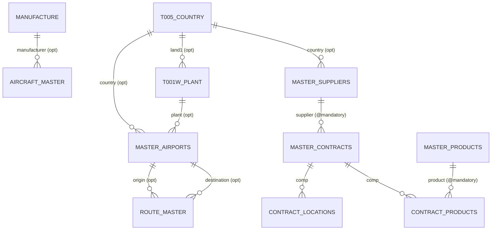
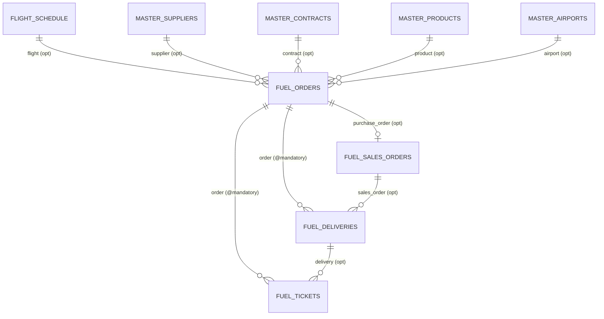
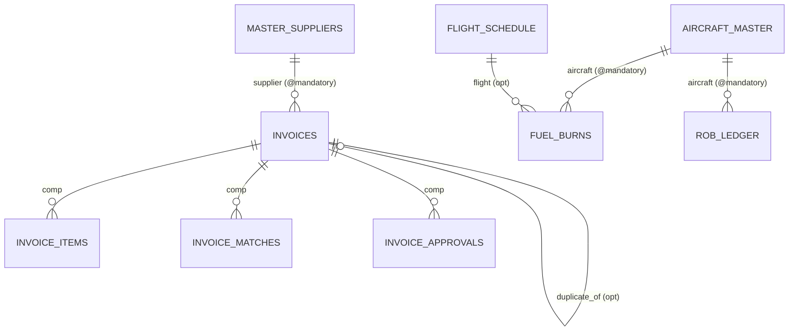
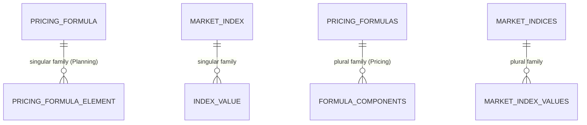

# SCHEMA.md — FuelSphere Data Model (As-Built)

> **Reconciliation baseline.** Documents the data model *as it exists in the code*, not as the design docs describe it. Every claim cites `file:line`. Where the model contradicts documentation, both are reported and the conflict flagged. Values that look like production data are not present in the schema itself (only in seed CSVs — see DATA_PROFILE.md).

## 0. Framing note (read first)

This is an **SAP CAP / CDS (Node.js)** project, **not ABAP**. The deliverable brief asks for "Z*/Y* tables, data elements, domains". Those ABAP dictionary concepts **do not exist here**. The equivalents are:

| Brief term | Actual artefact in this codebase |
|---|---|
| Custom table (Z*/Y*) | CDS `entity` in `db/schema.cds` (namespace `fuelsphere`) |
| Data element / domain | CDS type / enum `type` (e.g. `OrderStatus`), or inline `String(n)`/`Decimal(p,s)` |
| Secondary index | **NOT declared anywhere** — no `@cds.index` / index annotations exist (grep: 0 hits) |
| Foreign key | CDS `Association to` / `Composition of` — declared, enforced only if `@mandatory` + DB referential integrity |
| Append-only / versioned | Determined by handler code (see per-entity notes) |

- **Namespace:** `fuelsphere` (`db/schema.cds:13`).
- **Entity count:** **97** persistent entities in `db/schema.cds` (single file, ~4381 lines).
- **No CDS views** are defined in `db/schema.cds` (grep `view`/`define view`: 0). All "views" are OData **projections** in the 15 service `.cds` files (~185 projections). See §6.
- **No secondary indexes** are declared. Primary keys are as noted per entity.
- **Physical table names:** CAP generates DB tables as `FUELSPHERE_<ENTITY>` at deploy. The CSV seed files in `db/data/` are named `fuelsphere-<ENTITY>.csv` and are **semicolon-delimited**.

## 1. Common aspects (mixed into entities)

| Aspect | Def | Fields contributed |
|---|---|---|
| `cuid` | `@sap/cds/common` | `ID : UUID` (key) |
| `managed` | `@sap/cds/common` | `createdAt/createdBy/modifiedAt/modifiedBy` |
| `AuditTrail` | `db/schema.cds:24` | `created_at`(@insert:$now), `created_by`(@insert:$user), `modified_at`(@insert+update:$now), `modified_by`(@insert+update:$user) |
| `ActiveStatus` | `db/schema.cds:34` | `is_active : Boolean default true` |
| `CodeList` | `@sap/cds/common` | `name`, `descr` (localized) |

Note: `AuditTrail` records who/when but is **not** a concurrency token — there is no `@odata.etag` anywhere (see FINDINGS.md, concurrency).

## 2. Enum types (status domains) — exact literals

All `String`-based enums, quoted exactly (`db/schema.cds`):

| Type | Line | Literal values |
|---|---|---|
| PricingEngineMode | 257 | NATIVE, CPE, HYBRID |
| FormulaElementCategory | 266 | MARKET_INDEX, SERVICE_FEE, TAX |
| FormulaElementType | 275 | INDEX, FIXED, PERCENTAGE |
| FlightCycleEventType | 606 | LANDING, TAXI_IN, CHOCKS_ON, REFUELING, CHOCKS_OFF, TAXI_OUT, TAKEOFF, AIRBORNE |
| **OrderStatus** | 649 | Draft, Submitted, Confirmed, InProgress, Delivered, Completed, Cancelled |
| OrderPriority | 662 | Normal, High, Urgent |
| DeliveryStatus | 671 | Pending, Verified, Posted, Disputed |
| TicketStatus | 681 | Open, Attached, Verified, Closed |
| CrewReviewStatus | 691 | PENDING, CONFIRMED, ADJUSTED, SKIPPED |
| SalesOrderStatus | 701 | RECEIVED, CONFIRMED, SCHEDULED, IN_DELIVERY, DELIVERED, INVOICED, CLOSED, CANCELLED |
| PlanningVersionType | 1038 | BUDGET, FORECAST, SCENARIO |
| PlanningVersionStatus | 1048 | DRAFT, IN_REVIEW, APPROVED, LOCKED |
| SACWritebackStatus | 1058 | PENDING, SUCCESS, FAILED |
| PlanningPeriod | 1067 | MONTHLY, QUARTERLY |
| PriceSource | 1075 | DERIVED, MANUAL, CONTRACT |
| DemandCalculationMethod | 1084 | STANDARD, HISTORICAL, MANUAL |
| InvoiceStatus | 1319 | DRAFT, VERIFIED, POSTED, PAID, CANCELLED |
| InvoiceMatchStatus | 1330 | UNMATCHED, MATCHED, PARTIAL_MATCH, PRICE_VARIANCE, QTY_VARIANCE, EXCEPTION |
| InvoiceApprovalStatus | 1342 | PENDING, APPROVED, REJECTED, ESCALATED |
| ApprovalAction | 1352 | SUBMIT, APPROVE, REJECT, ESCALATE, RETURN |
| ToleranceType | 1363 | PRICE, QUANTITY, AMOUNT, DATE |
| SanctionedEntityType | 1653 | INDIVIDUAL, ORGANIZATION, VESSEL, AIRCRAFT |
| ComplianceCheckResult | 1663 | PASS, BLOCK, REVIEW |
| ComplianceCheckType | 1672 | COUNTRY, SUPPLIER, COMBINED |
| ComplianceExceptionStatus | 1681 | PENDING, APPROVED, REJECTED, EXPIRED |
| SanctionJurisdiction | 1691 | US, EU, UN, UK |
| FuelBurnDataSource | 1883 | ACARS, JEFFERSON, EFB, MANUAL |
| FuelBurnStatus | 1893 | PRELIMINARY, CONFIRMED, ADJUSTED, REJECTED |
| ROBEntryType | 1903 | FLIGHT, UPLIFT, ADJUSTMENT, INITIAL, TRANSFER |
| VarianceStatus | 1915 | NORMAL, WARNING, EXCEPTION, CRITICAL |
| AllocationType | 2076 | ACTUAL, ACCRUAL, REVERSAL, STANDARD |
| AllocationStatus | 2086 | DRAFT, PENDING, POSTED, REVERSED, FAILED |
| AllocationBasis | 2097 | QUANTITY, AMOUNT, PERCENTAGE |
| SettlementReceiverType | 2106 | COST_CENTER, PROFIT_CENTER, INTERNAL_ORDER, WBS |
| AllocationRunStatus | 2116 | SCHEDULED, RUNNING, COMPLETED, FAILED, CANCELLED |
| IntegrationDirection | 2394 | INBOUND, OUTBOUND, BIDIRECTIONAL |
| IntegrationStatus | 2395 | SUCCESS, FAILURE, PARTIAL, TIMEOUT, PENDING, RETRYING |
| MessageSeverity | 2396 | INFO, WARNING, ERROR, CRITICAL |
| (analytics/security/pricing-plural enums) | 2397–3947 | HealthStatus, RetryStatus, SyncDirection, ReportFormat, UserStatus, EventCategory, CampaignStatus, SoDStatus, IncidentStatus, PricingEngineType, FormulaType, FormulaStatus, ComponentType, IndexProvider, VarianceFlag, … (see `db/schema.cds` 2397–3947) |

> **Conflict (status literals):** `OrderStatus` enum defines `Draft` and `Completed`, but `order-service.js` writes the literal **`'Created'`** (not in the enum) on create (`order-service.js:101,273`) and **never** writes `'Completed'`. See FUNCTIONAL.md §Order lifecycle and FINDINGS.md.

---

## 3. Entity field catalogue (all 97 entities)

Tables generated directly from `db/schema.cds` (field name, raw declared type, key flag, `@mandatory`, default, association target). "Inherited" lists aspect-contributed fields not repeated in the table. PK shown per entity.

#### `T005_COUNTRY`  
Line 49 · aspects: `ActiveStatus`  
Inherited: is_active:Boolean=true (ActiveStatus)

| Field | Type (raw) | Key | Mand. | Default | Assoc |
|---|---|---|---|---|---|
| **land1** | `String(3)` | ✓ |  |  |  |
| landx | `String(50)` |  |  |  |  |
| landx50 | `String(100)` |  |  |  |  |
| natio | `String(15)` |  |  |  |  |
| landgr | `String(3)` |  |  |  |  |
| currcode | `String(3)` |  |  |  |  |
| spras | `String(2)` |  |  |  |  |
| is_embargoed | `Boolean default false` |  |  | false |  |
| embargo_effective_date | `Date` |  |  |  |  |
| embargo_reason | `String(500)` |  |  |  |  |
| sanction_programs | `String(200)` |  |  |  |  |
| risk_level | `String(10)` |  |  |  |  |

**PK:** land1

#### `CURRENCY_MASTER`  
Line 71 · aspects: `ActiveStatus`  
Inherited: is_active:Boolean=true (ActiveStatus)

| Field | Type (raw) | Key | Mand. | Default | Assoc |
|---|---|---|---|---|---|
| **currency_code** | `String(3)` | ✓ |  |  |  |
| currency_name | `String(50)` |  |  |  |  |
| decimal_places | `Integer` |  |  |  |  |
| symbol | `String(5)` |  |  |  |  |

**PK:** currency_code

#### `UNIT_OF_MEASURE`  
Line 83 · aspects: `ActiveStatus`  
Inherited: is_active:Boolean=true (ActiveStatus)

| Field | Type (raw) | Key | Mand. | Default | Assoc |
|---|---|---|---|---|---|
| **uom_code** | `String(3)` | ✓ |  |  |  |
| uom_name | `String(50)` |  |  |  |  |
| uom_category | `String(20)` |  |  |  |  |
| conversion_to_kg | `Decimal(15,6)` |  |  |  |  |

**PK:** uom_code

#### `T001W_PLANT`  
Line 95 · aspects: `ActiveStatus`  
Inherited: is_active:Boolean=true (ActiveStatus)

| Field | Type (raw) | Key | Mand. | Default | Assoc |
|---|---|---|---|---|---|
| **werks** | `String(4)` | ✓ |  |  |  |
| name1 | `String(30)` |  |  |  |  |
| stras | `String(100)` |  |  |  |  |
| ort01 | `String(50)` |  |  |  |  |
| land1 | `Association to T005_COUNTRY` |  |  |  | → T005_COUNTRY |
| regio | `String(3)` |  |  |  |  |
| pstlz | `String(10)` |  |  |  |  |
| spras | `String(2)` |  |  |  |  |

**PK:** werks

#### `MANUFACTURE`  
Line 114 · aspects: `ActiveStatus, AuditTrail`  
Inherited: created_at/created_by/modified_at/modified_by (AuditTrail); is_active:Boolean=true (ActiveStatus)

| Field | Type (raw) | Key | Mand. | Default | Assoc |
|---|---|---|---|---|---|
| **manufacture_code** | `String(2)` | ✓ |  |  |  |
| manufacture_name | `String(100)` |  |  |  |  |

**PK:** manufacture_code

#### `AIRCRAFT_OPSTATUS`  
Line 123 · aspects: `CodeList`  
Inherited: name/descr (CodeList)

| Field | Type (raw) | Key | Mand. | Default | Assoc |
|---|---|---|---|---|---|
| **status_code** | `String(20) default 'ACTIVE'` | ✓ |  | 'ACTIVE' |  |

**PK:** status_code

#### `AIRCRAFT_MASTER`  
Line 133 · aspects: `ActiveStatus, AuditTrail`  
Inherited: created_at/created_by/modified_at/modified_by (AuditTrail); is_active:Boolean=true (ActiveStatus)

| Field | Type (raw) | Key | Mand. | Default | Assoc |
|---|---|---|---|---|---|
| **type_code** | `String(10)` | ✓ |  |  |  |
| aircraft_model | `String(50)` |  |  |  |  |
| manufacturer | `Association to MANUFACTURE on manufacturer.manufacture_code ` |  |  |  | → MANUFACTURE |
| manufacturer_code | `String(2)` |  |  |  |  |
| fuel_capacity_kg | `Decimal(15,2)` |  |  |  |  |
| mtow_kg | `Decimal(15,2)` |  |  |  |  |
| cruise_burn_kgph | `Decimal(10,2)` |  |  |  |  |
| fleet_size | `Integer` |  |  |  |  |
| status | `Association to AIRCRAFT_OPSTATUS` |  |  |  | → AIRCRAFT_OPSTATUS |

**PK:** type_code

#### `MASTER_AIRPORTS`  
Line 151 · aspects: `cuid, ActiveStatus, AuditTrail`  
Inherited: ID:UUID (key, from cuid); created_at/created_by/modified_at/modified_by (AuditTrail); is_active:Boolean=true (ActiveStatus)

| Field | Type (raw) | Key | Mand. | Default | Assoc |
|---|---|---|---|---|---|
| iata_code | `String(3)` |  | ✓ |  |  |
| icao_code | `String(4)` |  |  |  |  |
| airport_name | `String(100)` |  | ✓ |  |  |
| city | `String(50)` |  | ✓ |  |  |
| country | `Association to T005_COUNTRY on country.land1 = country_code` |  |  |  | → T005_COUNTRY |
| country_code | `String(3)` |  | ✓ |  |  |
| timezone | `String(50)` |  |  |  |  |
| plant | `Association to T001W_PLANT on plant.werks = s4_plant_code` |  |  |  | → T001W_PLANT |
| s4_plant_code | `String(4)` |  |  |  |  |

**PK:** ID (from cuid)

#### `ROUTE_MASTER`  
Line 170 · aspects: `ActiveStatus, AuditTrail`  
Inherited: created_at/created_by/modified_at/modified_by (AuditTrail); is_active:Boolean=true (ActiveStatus)

| Field | Type (raw) | Key | Mand. | Default | Assoc |
|---|---|---|---|---|---|
| **route_code** | `String(20)` | ✓ |  |  |  |
| origin | `Association to MASTER_AIRPORTS on origin.iata_code = origin_` |  |  |  | → MASTER_AIRPORTS |
| origin_airport | `String(3)` |  | ✓ |  |  |
| destination | `Association to MASTER_AIRPORTS on destination.iata_code = de` |  |  |  | → MASTER_AIRPORTS |
| destination_airport | `String(3)` |  | ✓ |  |  |
| distance_km | `Decimal(10,2)` |  | ✓ |  |  |
| avg_flight_time | `String(10)` |  |  |  |  |
| fuel_required | `Decimal(15,2)` |  |  |  |  |
| alternate_count | `Integer default 0` |  |  | 0 |  |
| status | `String(20) default 'ACTIVE'` |  |  | 'ACTIVE' |  |

**PK:** route_code

#### `MASTER_SUPPLIERS`  
Line 194 · aspects: `cuid, ActiveStatus, AuditTrail`  
Inherited: ID:UUID (key, from cuid); created_at/created_by/modified_at/modified_by (AuditTrail); is_active:Boolean=true (ActiveStatus)

| Field | Type (raw) | Key | Mand. | Default | Assoc |
|---|---|---|---|---|---|
| supplier_code | `String(20)` |  | ✓ |  |  |
| supplier_name | `String(100)` |  | ✓ |  |  |
| supplier_type | `String(20)` |  | ✓ |  |  |
| country | `Association to T005_COUNTRY on country.land1 = country_code` |  |  |  | → T005_COUNTRY |
| country_code | `String(3)` |  | ✓ |  |  |
| payment_terms | `String(20)` |  |  |  |  |
| s4_vendor_no | `String(10)` |  |  |  |  |

**PK:** ID (from cuid)

#### `MASTER_PRODUCTS`  
Line 211 · aspects: `cuid, ActiveStatus, AuditTrail`  
Inherited: ID:UUID (key, from cuid); created_at/created_by/modified_at/modified_by (AuditTrail); is_active:Boolean=true (ActiveStatus)

| Field | Type (raw) | Key | Mand. | Default | Assoc |
|---|---|---|---|---|---|
| product_code | `String(20)` |  | ✓ |  |  |
| product_name | `String(100)` |  | ✓ |  |  |
| product_type | `String(20)` |  | ✓ |  |  |
| specification | `String(50)` |  | ✓ |  |  |
| uom | `Association to UNIT_OF_MEASURE on uom.uom_code = uom_code` |  |  |  | → UNIT_OF_MEASURE |
| uom_code | `String(3)` |  | ✓ |  |  |
| s4_material_number | `String(18)` |  |  |  |  |

**PK:** ID (from cuid)

#### `MASTER_CONTRACTS`  
Line 228 · aspects: `cuid, ActiveStatus, AuditTrail`  
Inherited: ID:UUID (key, from cuid); created_at/created_by/modified_at/modified_by (AuditTrail); is_active:Boolean=true (ActiveStatus)

| Field | Type (raw) | Key | Mand. | Default | Assoc |
|---|---|---|---|---|---|
| contract_number | `String(20)` |  | ✓ |  |  |
| contract_name | `String(100)` |  | ✓ |  |  |
| supplier | `Association to MASTER_SUPPLIERS` |  |  |  | → MASTER_SUPPLIERS |
| valid_from | `Date` |  | ✓ |  |  |
| valid_to | `Date` |  | ✓ |  |  |
| contract_type | `String(20)` |  | ✓ |  |  |
| price_type | `String(20)` |  | ✓ |  |  |
| currency | `Association to CURRENCY_MASTER on currency.currency_code = c` |  |  |  | → CURRENCY_MASTER |
| currency_code | `String(3)` |  | ✓ |  |  |
| payment_terms | `String(20)` |  |  |  |  |
| incoterms | `String(10)` |  |  |  |  |
| min_volume_kg | `Decimal(15,2)` |  |  |  |  |
| max_volume_kg | `Decimal(15,2)` |  |  |  |  |
| s4_contract_number | `String(10)` |  |  |  |  |
| locations | `Composition of many CONTRACT_LOCATIONS on locations.contract` |  |  |  | ⊃ CONTRACT_LOCATIONS (comp) |
| products | `Composition of many CONTRACT_PRODUCTS on products.contract =` |  |  |  | ⊃ CONTRACT_PRODUCTS (comp) |

**PK:** ID (from cuid)

#### `PRICING_CONFIG`  
Line 288 · aspects: `cuid, ActiveStatus, AuditTrail`  
Inherited: ID:UUID (key, from cuid); created_at/created_by/modified_at/modified_by (AuditTrail); is_active:Boolean=true (ActiveStatus)

| Field | Type (raw) | Key | Mand. | Default | Assoc |
|---|---|---|---|---|---|
| config_code | `String(20)` |  | ✓ |  |  |
| company_code | `String(10)` |  |  |  |  |
| engine_mode | `PricingEngineMode default 'NATIVE'` |  |  | 'NATIVE' |  |
| fallback_enabled | `Boolean default true` |  |  | true |  |
| variance_threshold | `Decimal(5,2) default 5.00` |  |  | 5.00 |  |
| cpe_cache_ttl_mins | `Integer default 30` |  |  | 30 |  |
| cpe_endpoint_url | `String(500)` |  |  |  |  |
| valid_from | `Date` |  | ✓ |  |  |
| valid_to | `Date` |  |  |  |  |

**PK:** ID (from cuid)

#### `PRICING_FORMULA`  
Line 307 · aspects: `cuid, ActiveStatus, AuditTrail`  
Inherited: ID:UUID (key, from cuid); created_at/created_by/modified_at/modified_by (AuditTrail); is_active:Boolean=true (ActiveStatus)

| Field | Type (raw) | Key | Mand. | Default | Assoc |
|---|---|---|---|---|---|
| formula_code | `String(20)` |  | ✓ |  |  |
| formula_name | `String(100)` |  | ✓ |  |  |
| description | `String(500)` |  |  |  |  |
| contract | `Association to MASTER_CONTRACTS` |  |  |  | → MASTER_CONTRACTS |
| currency | `Association to CURRENCY_MASTER on currency.currency_code = c` |  |  |  | → CURRENCY_MASTER |
| currency_code | `String(3)` |  | ✓ |  |  |
| uom | `Association to UNIT_OF_MEASURE on uom.uom_code = uom_code` |  |  |  | → UNIT_OF_MEASURE |
| uom_code | `String(3)` |  | ✓ |  |  |
| valid_from | `Date` |  | ✓ |  |  |
| valid_to | `Date` |  |  |  |  |
| elements | `Composition of many PRICING_FORMULA_ELEMENT on elements.form` |  |  |  | ⊃ PRICING_FORMULA_ELEMENT (comp) |

**PK:** ID (from cuid)

#### `PRICING_FORMULA_ELEMENT`  
Line 332 · aspects: `cuid, ActiveStatus`  
Inherited: ID:UUID (key, from cuid); is_active:Boolean=true (ActiveStatus)

| Field | Type (raw) | Key | Mand. | Default | Assoc |
|---|---|---|---|---|---|
| formula | `Association to PRICING_FORMULA` |  | ✓ |  | → PRICING_FORMULA |
| sequence | `Integer` |  | ✓ |  |  |
| element_code | `String(20)` |  | ✓ |  |  |
| element_name | `String(100)` |  | ✓ |  |  |
| category | `FormulaElementCategory` |  | ✓ |  |  |
| element_type | `FormulaElementType` |  | ✓ |  |  |
| market_index | `Association to MARKET_INDEX` |  |  |  | → MARKET_INDEX |
| fixed_value | `Decimal(15,4)` |  |  |  |  |
| percentage_value | `Decimal(8,4)` |  |  |  |  |
| currency_code | `String(3)` |  |  |  |  |
| is_taxable | `Boolean default true` |  |  | true |  |
| valid_from | `Date` |  |  |  |  |
| valid_to | `Date` |  |  |  |  |

**PK:** ID (from cuid)

#### `MARKET_INDEX`  
Line 354 · aspects: `cuid, ActiveStatus, AuditTrail`  
Inherited: ID:UUID (key, from cuid); created_at/created_by/modified_at/modified_by (AuditTrail); is_active:Boolean=true (ActiveStatus)

| Field | Type (raw) | Key | Mand. | Default | Assoc |
|---|---|---|---|---|---|
| index_code | `String(20)` |  | ✓ |  |  |
| index_name | `String(100)` |  | ✓ |  |  |
| index_provider | `String(50)` |  | ✓ |  |  |
| index_region | `String(50)` |  | ✓ |  |  |
| product_type | `String(20)` |  | ✓ |  |  |
| currency | `Association to CURRENCY_MASTER on currency.currency_code = c` |  |  |  | → CURRENCY_MASTER |
| currency_code | `String(3)` |  | ✓ |  |  |
| uom | `Association to UNIT_OF_MEASURE on uom.uom_code = uom_code` |  |  |  | → UNIT_OF_MEASURE |
| uom_code | `String(3)` |  | ✓ |  |  |
| publication_frequency | `String(20)` |  | ✓ |  |  |
| publication_lag_days | `Integer default 0` |  |  | 0 |  |
| data_source_url | `String(500)` |  |  |  |  |
| values | `Composition of many INDEX_VALUE on values.marketIndex = $sel` |  |  |  | ⊃ INDEX_VALUE (comp) |

**PK:** ID (from cuid)

#### `INDEX_VALUE`  
Line 377 · aspects: `cuid`  
Inherited: ID:UUID (key, from cuid)

| Field | Type (raw) | Key | Mand. | Default | Assoc |
|---|---|---|---|---|---|
| marketIndex | `Association to MARKET_INDEX` |  | ✓ |  | → MARKET_INDEX |
| effective_date | `Date` |  | ✓ |  |  |
| price_value | `Decimal(15,4)` |  | ✓ |  |  |
| price_low | `Decimal(15,4)` |  |  |  |  |
| price_high | `Decimal(15,4)` |  |  |  |  |
| source_reference | `String(100)` |  |  |  |  |
| imported_at | `DateTime @cds.on.insert: $now` |  |  |  |  |
| imported_by | `String(100)` |  |  |  |  |

**PK:** ID (from cuid)

#### `DERIVED_PRICE`  
Line 395 · aspects: `cuid`  
Inherited: ID:UUID (key, from cuid)

| Field | Type (raw) | Key | Mand. | Default | Assoc |
|---|---|---|---|---|---|
| calculation_id | `String(36)` |  | ✓ |  |  |
| contract | `Association to MASTER_CONTRACTS` |  |  |  | → MASTER_CONTRACTS |
| formula | `Association to PRICING_FORMULA` |  |  |  | → PRICING_FORMULA |
| airport | `Association to MASTER_AIRPORTS` |  |  |  | → MASTER_AIRPORTS |
| product | `Association to MASTER_PRODUCTS` |  |  |  | → MASTER_PRODUCTS |
| calculation_date | `Date` |  | ✓ |  |  |
| quantity | `Decimal(15,2)` |  | ✓ |  |  |
| uom_code | `String(3)` |  | ✓ |  |  |
| engine_mode | `PricingEngineMode` |  | ✓ |  |  |
| engine_used | `String(20)` |  | ✓ |  |  |
| base_price | `Decimal(15,4)` |  |  |  |  |
| total_service_fees | `Decimal(15,4)` |  |  |  |  |
| total_taxes | `Decimal(15,4)` |  |  |  |  |
| final_unit_price | `Decimal(15,4)` |  | ✓ |  |  |
| total_amount | `Decimal(15,2)` |  | ✓ |  |  |
| currency_code | `String(3)` |  | ✓ |  |  |
| cpe_unit_price | `Decimal(15,4)` |  |  |  |  |
| native_unit_price | `Decimal(15,4)` |  |  |  |  |
| variance_amount | `Decimal(15,4)` |  |  |  |  |
| variance_percentage | `Decimal(5,2)` |  |  |  |  |
| variance_flag | `Boolean default false` |  |  | false |  |
| price_breakdown | `LargeString` |  |  |  |  |
| calculated_at | `DateTime @cds.on.insert: $now` |  |  |  |  |
| calculated_by | `String(100)` |  |  |  |  |
| calculation_duration_ms | `Integer` |  |  |  |  |

**PK:** ID (from cuid)

#### `CONTRACT_LOCATIONS`  
Line 441 · aspects: `cuid, ActiveStatus, AuditTrail`  
Inherited: ID:UUID (key, from cuid); created_at/created_by/modified_at/modified_by (AuditTrail); is_active:Boolean=true (ActiveStatus)

| Field | Type (raw) | Key | Mand. | Default | Assoc |
|---|---|---|---|---|---|
| contract | `Association to MASTER_CONTRACTS` |  | ✓ |  | → MASTER_CONTRACTS |
| airport | `Association to MASTER_AIRPORTS` |  |  |  | → MASTER_AIRPORTS |
| plant_code | `String(4)` |  |  |  |  |
| location_type | `String(20) default 'PRIMARY'` |  |  | 'PRIMARY' |  |
| location_premium | `Decimal(15,4)` |  |  |  |  |
| priority | `Integer default 1` |  |  | 1 |  |
| valid_from | `Date` |  | ✓ |  |  |
| valid_to | `Date` |  |  |  |  |

**PK:** ID (from cuid)

#### `CONTRACT_PRODUCTS`  
Line 458 · aspects: `cuid, ActiveStatus, AuditTrail`  
Inherited: ID:UUID (key, from cuid); created_at/created_by/modified_at/modified_by (AuditTrail); is_active:Boolean=true (ActiveStatus)

| Field | Type (raw) | Key | Mand. | Default | Assoc |
|---|---|---|---|---|---|
| contract | `Association to MASTER_CONTRACTS` |  | ✓ |  | → MASTER_CONTRACTS |
| product | `Association to MASTER_PRODUCTS` |  | ✓ |  | → MASTER_PRODUCTS |
| product_premium | `Decimal(15,4)` |  |  |  |  |
| min_quantity | `Decimal(15,2)` |  |  |  |  |
| max_quantity | `Decimal(15,2)` |  |  |  |  |
| is_default | `Boolean default false` |  |  | false |  |

**PK:** ID (from cuid)

#### `CONFIG_PERSONAS`  
Line 475 · aspects: `cuid`  
Inherited: ID:UUID (key, from cuid)

| Field | Type (raw) | Key | Mand. | Default | Assoc |
|---|---|---|---|---|---|
| persona_id | `String(30)` |  | ✓ |  |  |
| persona_name | `String(100)` |  | ✓ |  |  |
| description | `String(500)` |  |  |  |  |
| is_active | `Boolean default true` |  |  | true |  |

**PK:** ID (from cuid)

#### `CONFIG_TILES`  
Line 486 · aspects: `cuid`  
Inherited: ID:UUID (key, from cuid)

| Field | Type (raw) | Key | Mand. | Default | Assoc |
|---|---|---|---|---|---|
| tile_id | `String(50)` |  | ✓ |  |  |
| tile_name | `String(100)` |  | ✓ |  |  |
| tile_group | `String(50)` |  |  |  |  |
| target_url | `String(500)` |  |  |  |  |
| icon | `String(100)` |  |  |  |  |
| is_active | `Boolean default true` |  |  | true |  |

**PK:** ID (from cuid)

#### `CONFIG_PERSONA_TILES`  
Line 499 · aspects: `cuid`  
Inherited: ID:UUID (key, from cuid)

| Field | Type (raw) | Key | Mand. | Default | Assoc |
|---|---|---|---|---|---|
| persona | `Association to CONFIG_PERSONAS` |  |  |  | → CONFIG_PERSONAS |
| tile | `Association to CONFIG_TILES` |  |  |  | → CONFIG_TILES |
| access_level | `String(10) default 'VIEW'` |  |  | 'VIEW' |  |
| is_active | `Boolean default true` |  |  | true |  |

**PK:** ID (from cuid)

#### `CONFIG_USER_PERSONAS`  
Line 510 · aspects: `cuid, managed`  
Inherited: ID:UUID (key, from cuid); createdAt/createdBy/modifiedAt/modifiedBy (managed)

| Field | Type (raw) | Key | Mand. | Default | Assoc |
|---|---|---|---|---|---|
| user_id | `String(255)` |  | ✓ |  |  |
| persona | `Association to CONFIG_PERSONAS` |  |  |  | → CONFIG_PERSONAS |
| station | `String(3)` |  |  |  |  |
| region | `String(20)` |  |  |  |  |
| is_active | `Boolean default true` |  |  | true |  |

**PK:** ID (from cuid)

#### `CONFIG_APPROVAL_LIMITS`  
Line 522 · aspects: `cuid`  
Inherited: ID:UUID (key, from cuid)

| Field | Type (raw) | Key | Mand. | Default | Assoc |
|---|---|---|---|---|---|
| persona | `Association to CONFIG_PERSONAS` |  |  |  | → CONFIG_PERSONAS |
| limit_type | `String(30)` |  | ✓ |  |  |
| limit_value | `Decimal(15,2)` |  |  |  |  |
| is_active | `Boolean default true` |  |  | true |  |

**PK:** ID (from cuid)

#### `FLIGHT_SCHEDULE`  
Line 538 · aspects: `cuid, AuditTrail`  
Inherited: ID:UUID (key, from cuid); created_at/created_by/modified_at/modified_by (AuditTrail)

| Field | Type (raw) | Key | Mand. | Default | Assoc |
|---|---|---|---|---|---|
| flight_number | `String(10)` |  | ✓ |  |  |
| flight_date | `Date` |  | ✓ |  |  |
| aircraft | `Association to AIRCRAFT_MASTER on aircraft.type_code = aircr` |  |  |  | → AIRCRAFT_MASTER |
| aircraft_type | `String(10)` |  |  |  |  |
| aircraft_reg | `String(10)` |  |  |  |  |
| origin | `Association to MASTER_AIRPORTS on origin.iata_code = origin_` |  |  |  | → MASTER_AIRPORTS |
| origin_airport | `String(3)` |  | ✓ |  |  |
| destination | `Association to MASTER_AIRPORTS on destination.iata_code = de` |  |  |  | → MASTER_AIRPORTS |
| destination_airport | `String(3)` |  | ✓ |  |  |
| scheduled_departure | `Time` |  |  |  |  |
| scheduled_arrival | `Time` |  |  |  |  |
| status | `String(20) default 'SCHEDULED'` |  |  | 'SCHEDULED' |  |
| fuel_order | `Association to FUEL_ORDERS on fuel_order.flight = $self` |  |  |  | → FUEL_ORDERS |
| fuel_order_number | `String(25)` |  |  |  |  |
| airline_code | `String(3)` |  |  |  |  |
| flight_suffix | `String(2)` |  |  |  |  |
| service_type | `String(1)` |  |  |  |  |
| departure_terminal | `String(10)` |  |  |  |  |
| arrival_terminal | `String(10)` |  |  |  |  |
| gate_number | `String(10)` |  |  |  |  |
| stand_number | `String(10)` |  |  |  |  |
| sobt | `DateTime` |  |  |  |  |
| sibt | `DateTime` |  |  |  |  |
| eobt | `DateTime` |  |  |  |  |
| eibt | `DateTime` |  |  |  |  |
| aobt | `DateTime` |  |  |  |  |
| aibt | `DateTime` |  |  |  |  |
| atot | `DateTime` |  |  |  |  |
| aldt | `DateTime` |  |  |  |  |
| planned_block_mins | `Integer` |  |  |  |  |
| actual_block_mins | `Integer` |  |  |  |  |
| flight_nature | `String(10)` |  |  |  |  |
| linked_flight_number | `String(10)` |  |  |  |  |
| linked_flight_date | `Date` |  |  |  |  |
| codeshare_flights | `String(100)` |  |  |  |  |
| delay_code | `String(10)` |  |  |  |  |
| delay_minutes | `Integer` |  |  |  |  |
| cancellation_reason | `String(200)` |  |  |  |  |
| booked_passengers | `Integer` |  |  |  |  |
| boarded_passengers | `Integer` |  |  |  |  |
| cargo_kg | `Decimal(10,2)` |  |  |  |  |
| captain_name | `String(100)` |  |  |  |  |

**PK:** ID (from cuid)

#### `FLIGHT_CYCLE_EVENTS`  
Line 622 · aspects: `cuid, AuditTrail`  
Inherited: ID:UUID (key, from cuid); created_at/created_by/modified_at/modified_by (AuditTrail)

| Field | Type (raw) | Key | Mand. | Default | Assoc |
|---|---|---|---|---|---|
| flight | `Association to FLIGHT_SCHEDULE` |  | ✓ |  | → FLIGHT_SCHEDULE |
| fuel_order | `Association to FUEL_ORDERS` |  |  |  | → FUEL_ORDERS |
| event_type | `FlightCycleEventType` |  | ✓ |  |  |
| event_timestamp | `Timestamp` |  | ✓ |  |  |
| recorded_by | `String(50)` |  |  |  |  |
| source_system | `String(30)` |  |  |  |  |
| latitude | `Decimal(10,7)` |  |  |  |  |
| longitude | `Decimal(10,7)` |  |  |  |  |
| remarks | `String(500)` |  |  |  |  |
| uplift_kg | `Decimal(12,2)` |  |  |  |  |
| density_kg_l | `Decimal(6,4)` |  |  |  |  |
| temperature_c | `Decimal(5,1)` |  |  |  |  |
| bowser_id | `String(20)` |  |  |  |  |
| sequence_number | `Integer` |  |  |  |  |

**PK:** ID (from cuid)

#### `FUEL_ORDERS`  
Line 723 · aspects: `cuid, AuditTrail`  
Inherited: ID:UUID (key, from cuid); created_at/created_by/modified_at/modified_by (AuditTrail)

| Field | Type (raw) | Key | Mand. | Default | Assoc |
|---|---|---|---|---|---|
| order_number | `String(25)` |  | ✓ |  |  |
| flight | `Association to FLIGHT_SCHEDULE` |  |  |  | → FLIGHT_SCHEDULE |
| airport | `Association to MASTER_AIRPORTS` |  |  |  | → MASTER_AIRPORTS |
| station_code | `String(3)` |  | ✓ |  |  |
| supplier | `Association to MASTER_SUPPLIERS` |  |  |  | → MASTER_SUPPLIERS |
| contract | `Association to MASTER_CONTRACTS` |  |  |  | → MASTER_CONTRACTS |
| product | `Association to MASTER_PRODUCTS` |  |  |  | → MASTER_PRODUCTS |
| uom | `Association to UNIT_OF_MEASURE on uom.uom_code = uom_code` |  |  |  | → UNIT_OF_MEASURE |
| uom_code | `String(3) default 'KG'` |  |  | 'KG' |  |
| ordered_quantity | `Decimal(12,2)` |  | ✓ |  |  |
| unit_price | `Decimal(15,4)` |  |  |  |  |
| total_amount | `Decimal(15,2)` |  |  |  |  |
| currency | `Association to CURRENCY_MASTER on currency.currency_code = c` |  |  |  | → CURRENCY_MASTER |
| currency_code | `String(3) default 'USD'` |  |  | 'USD' |  |
| requested_date | `Date` |  | ✓ |  |  |
| requested_time | `Time` |  |  |  |  |
| priority | `OrderPriority default 'Normal'` |  |  | 'Normal' |  |
| status | `OrderStatus default 'Draft'` |  |  | 'Draft' |  |
| s4_po_number | `String(10)` |  |  |  |  |
| s4_po_item | `String(5)` |  |  |  |  |
| dispatch_fuel_order_id | `String(20)` |  |  |  |  |
| crew_review_status | `CrewReviewStatus` |  |  |  |  |
| crew_reviewed_by | `String(100)` |  |  |  |  |
| crew_reviewed_at | `DateTime` |  |  |  |  |
| crew_adjusted_quantity | `Decimal(12,2)` |  |  |  |  |
| crew_adjustment_reason | `String(500)` |  |  |  |  |
| crew_notes | `String(1000)` |  |  |  |  |
| notes | `String(1000)` |  |  |  |  |
| cancelled_reason | `String(500)` |  |  |  |  |
| cancelled_by | `String(100)` |  |  |  |  |
| cancelled_at | `DateTime` |  |  |  |  |
| deliveries | `Composition of many FUEL_DELIVERIES on deliveries.order = $s` |  |  |  | ⊃ FUEL_DELIVERIES (comp) |
| tickets | `Composition of many FUEL_TICKETS on tickets.order = $self` |  |  |  | ⊃ FUEL_TICKETS (comp) |

**PK:** ID (from cuid)

#### `FUEL_DELIVERIES`  
Line 796 · aspects: `cuid, AuditTrail`  
Inherited: ID:UUID (key, from cuid); created_at/created_by/modified_at/modified_by (AuditTrail)

| Field | Type (raw) | Key | Mand. | Default | Assoc |
|---|---|---|---|---|---|
| order | `Association to FUEL_ORDERS` |  | ✓ |  | → FUEL_ORDERS |
| sales_order | `Association to FUEL_SALES_ORDERS` |  |  |  | → FUEL_SALES_ORDERS |
| delivery_number | `String(25)` |  | ✓ |  |  |
| delivery_date | `Date` |  | ✓ |  |  |
| delivery_time | `Time` |  | ✓ |  |  |
| delivered_quantity | `Decimal(12,2)` |  | ✓ |  |  |
| temperature | `Decimal(5,2)` |  |  |  |  |
| density | `Decimal(8,4)` |  |  |  |  |
| temperature_corrected_qty | `Decimal(12,2)` |  |  |  |  |
| vehicle_id | `String(20)` |  |  |  |  |
| driver_name | `String(100)` |  |  |  |  |
| pilot_signature | `LargeBinary` |  |  |  |  |
| pilot_name | `String(100)` |  |  |  |  |
| ground_crew_signature | `LargeBinary` |  |  |  |  |
| ground_crew_name | `String(100)` |  |  |  |  |
| signature_timestamp | `Timestamp` |  |  |  |  |
| signature_location | `String(100)` |  |  |  |  |
| s4_gr_number | `String(10)` |  |  |  |  |
| s4_gr_year | `String(4)` |  |  |  |  |
| s4_gr_item | `String(4)` |  |  |  |  |
| status | `DeliveryStatus default 'Pending'` |  |  | 'Pending' |  |
| quantity_variance | `Decimal(12,2)` |  |  |  |  |
| variance_percentage | `Decimal(5,2)` |  |  |  |  |
| variance_flag | `Boolean default false` |  |  | false |  |
| variance_reason | `String(500)` |  |  |  |  |

**PK:** ID (from cuid)

#### `FUEL_TICKETS`  
Line 848 · aspects: `cuid, AuditTrail`  
Inherited: ID:UUID (key, from cuid); created_at/created_by/modified_at/modified_by (AuditTrail)

| Field | Type (raw) | Key | Mand. | Default | Assoc |
|---|---|---|---|---|---|
| order | `Association to FUEL_ORDERS` |  | ✓ |  | → FUEL_ORDERS |
| delivery | `Association to FUEL_DELIVERIES` |  |  |  | → FUEL_DELIVERIES |
| ticket_number | `String(50)` |  | ✓ |  |  |
| internal_number | `String(25)` |  |  |  |  |
| aircraft_reg | `String(10)` |  |  |  |  |
| flight_number | `String(10)` |  |  |  |  |
| quantity | `Decimal(15,2)` |  | ✓ |  |  |
| uom_code | `String(3) default 'KG'` |  |  | 'KG' |  |
| delivery_timestamp | `DateTime` |  | ✓ |  |  |
| supplier_ticket_ref | `String(50)` |  |  |  |  |
| status | `TicketStatus default 'Open'` |  |  | 'Open' |  |
| verified_by | `String(100)` |  |  |  |  |
| verified_at | `DateTime` |  |  |  |  |

**PK:** ID (from cuid)

#### `FUEL_SALES_ORDERS`  
Line 889 · aspects: `cuid, AuditTrail`  
Inherited: ID:UUID (key, from cuid); created_at/created_by/modified_at/modified_by (AuditTrail)

| Field | Type (raw) | Key | Mand. | Default | Assoc |
|---|---|---|---|---|---|
| sales_order_number | `String(25)` |  | ✓ |  |  |
| purchase_order | `Association to FUEL_ORDERS` |  |  |  | → FUEL_ORDERS |
| customer_order_number | `String(25)` |  |  |  |  |
| customer_airline | `String(100)` |  | ✓ |  |  |
| customer_airline_code | `String(3)` |  |  |  |  |
| flight | `Association to FLIGHT_SCHEDULE` |  |  |  | → FLIGHT_SCHEDULE |
| flight_number | `String(10)` |  |  |  |  |
| flight_date | `Date` |  |  |  |  |
| airport | `Association to MASTER_AIRPORTS` |  |  |  | → MASTER_AIRPORTS |
| station_code | `String(3)` |  | ✓ |  |  |
| supplier | `Association to MASTER_SUPPLIERS` |  |  |  | → MASTER_SUPPLIERS |
| contract | `Association to MASTER_CONTRACTS` |  |  |  | → MASTER_CONTRACTS |
| product | `Association to MASTER_PRODUCTS` |  |  |  | → MASTER_PRODUCTS |
| uom_code | `String(3) default 'KG'` |  |  | 'KG' |  |
| estimated_quantity | `Decimal(12,2)` |  |  |  |  |
| requested_quantity | `Decimal(12,2)` |  |  |  |  |
| crew_confirmed_qty | `Decimal(12,2)` |  |  |  |  |
| delivered_quantity | `Decimal(12,2)` |  |  |  |  |
| unit_price | `Decimal(15,4)` |  |  |  |  |
| total_amount | `Decimal(15,2)` |  |  |  |  |
| currency_code | `String(3) default 'USD'` |  |  | 'USD' |  |
| scheduled_date | `Date` |  |  |  |  |
| scheduled_time | `Time` |  |  |  |  |
| vehicle_id | `String(20)` |  |  |  |  |
| driver_name | `String(100)` |  |  |  |  |
| status | `SalesOrderStatus default 'RECEIVED'` |  |  | 'RECEIVED' |  |
| confirmed_at | `DateTime` |  |  |  |  |
| delivered_at | `DateTime` |  |  |  |  |
| invoiced_at | `DateTime` |  |  |  |  |
| invoice_number | `String(25)` |  |  |  |  |
| invoice_date | `Date` |  |  |  |  |
| invoice_amount | `Decimal(15,2)` |  |  |  |  |
| notes | `String(1000)` |  |  |  |  |

**PK:** ID (from cuid)

#### `FLIGHT_DISPATCH`  
Line 966 · aspects: `cuid, AuditTrail`  
Inherited: ID:UUID (key, from cuid); created_at/created_by/modified_at/modified_by (AuditTrail)

| Field | Type (raw) | Key | Mand. | Default | Assoc |
|---|---|---|---|---|---|
| dispatch_order_id | `String(20)` |  | ✓ |  |  |
| flight_number | `String(10)` |  | ✓ |  |  |
| flight_date | `Date` |  | ✓ |  |  |
| flight_schedule | `Association to FLIGHT_SCHEDULE` |  |  |  | → FLIGHT_SCHEDULE |
| fuel_order | `Association to FUEL_ORDERS` |  |  |  | → FUEL_ORDERS |
| tail_number | `String(10)` |  |  |  |  |
| captain_id | `String(20)` |  |  |  |  |
| dispatcher_id | `String(20)` |  |  |  |  |
| atd | `DateTime` |  |  |  |  |
| ata | `DateTime` |  |  |  |  |
| atd_local | `DateTime` |  |  |  |  |
| ata_local | `DateTime` |  |  |  |  |
| std_gst | `DateTime` |  |  |  |  |
| sta_gst | `DateTime` |  |  |  |  |
| atd_gst | `DateTime` |  |  |  |  |
| ata_gst | `DateTime` |  |  |  |  |
| dispatch_timestamp | `DateTime` |  |  |  |  |
| dispatch_qty_kg | `Decimal(10,2)` |  |  |  |  |
| rob_departure_kg | `Decimal(10,2)` |  |  |  |  |
| payload_kg | `Decimal(10,2)` |  |  |  |  |
| payload_plan_kg | `Decimal(10,2)` |  |  |  |  |
| arrival_rob_plan_kg | `Decimal(12,2)` |  |  |  |  |
| flight_level | `Integer` |  |  |  |  |
| wind_component | `Decimal(5,1)` |  |  |  |  |
| alternate_airport | `String(3)` |  |  |  |  |
| dispatch_source | `String(15)` |  |  |  |  |
| ofplan_reference | `String(30)` |  |  |  |  |
| remarks | `String(200)` |  |  |  |  |

**PK:** ID (from cuid)

#### `AUDIT_LOG`  
Line 1018 · aspects: `cuid`  
Inherited: ID:UUID (key, from cuid)

| Field | Type (raw) | Key | Mand. | Default | Assoc |
|---|---|---|---|---|---|
| entity_name | `String(100)` |  | ✓ |  |  |
| entity_key | `String(255)` |  | ✓ |  |  |
| action | `String(20)` |  | ✓ |  |  |
| changed_by | `String(255)` |  |  |  |  |
| changed_at | `DateTime @cds.on.insert: $now` |  |  |  |  |
| old_values | `LargeString` |  |  |  |  |
| new_values | `LargeString` |  |  |  |  |
| ip_address | `String(50)` |  |  |  |  |
| user_agent | `String(500)` |  |  |  |  |

**PK:** ID (from cuid)

#### `PLANNING_VERSION`  
Line 1100 · aspects: `cuid, AuditTrail`  
Inherited: ID:UUID (key, from cuid); created_at/created_by/modified_at/modified_by (AuditTrail)

| Field | Type (raw) | Key | Mand. | Default | Assoc |
|---|---|---|---|---|---|
| version_id | `String(50)` |  | ✓ |  |  |
| version_name | `String(100)` |  | ✓ |  |  |
| version_type | `PlanningVersionType` |  | ✓ |  |  |
| fiscal_year | `String(4)` |  | ✓ |  |  |
| planning_period | `PlanningPeriod default 'MONTHLY'` |  |  | 'MONTHLY' |  |
| status | `PlanningVersionStatus default 'DRAFT'` |  |  | 'DRAFT' |  |
| description | `String(500)` |  |  |  |  |
| based_on_schedule | `Association to FLIGHT_SCHEDULE` |  |  |  | → FLIGHT_SCHEDULE |
| approved_by | `String(255)` |  |  |  |  |
| approved_at | `Timestamp` |  |  |  |  |
| sac_writeback_status | `SACWritebackStatus default 'PENDING'` |  |  | 'PENDING' |  |
| sac_model_id | `String(100)` |  |  |  |  |
| sac_writeback_at | `Timestamp` |  |  |  |  |
| lines | `Composition of many PLANNING_LINE on lines.version = $self` |  |  |  | ⊃ PLANNING_LINE (comp) |
| calculations | `Composition of many DEMAND_CALCULATION on calculations.versi` |  |  |  | ⊃ DEMAND_CALCULATION (comp) |

**PK:** ID (from cuid)

#### `PLANNING_LINE`  
Line 1134 · aspects: `cuid`  
Inherited: ID:UUID (key, from cuid)

| Field | Type (raw) | Key | Mand. | Default | Assoc |
|---|---|---|---|---|---|
| version | `Association to PLANNING_VERSION` |  | ✓ |  | → PLANNING_VERSION |
| airport | `Association to MASTER_AIRPORTS` |  | ✓ |  | → MASTER_AIRPORTS |
| period | `String(10)` |  | ✓ |  |  |
| planned_volume | `Decimal(15,2)` |  | ✓ |  |  |
| uom_code | `String(3) default 'KG'` |  |  | 'KG' |  |
| planned_price | `Decimal(15,4)` |  | ✓ |  |  |
| planned_cost | `Decimal(18,2)` |  | ✓ |  |  |
| currency | `Association to CURRENCY_MASTER on currency.currency_code = c` |  |  |  | → CURRENCY_MASTER |
| currency_code | `String(3)` |  | ✓ |  |  |
| price_source | `PriceSource default 'DERIVED'` |  |  | 'DERIVED' |  |
| flight_count | `Integer default 0` |  |  | 0 |  |
| prior_year_volume | `Decimal(15,2)` |  |  |  |  |
| prior_year_cost | `Decimal(18,2)` |  |  |  |  |
| volume_variance_pct | `Decimal(5,2)` |  |  |  |  |
| cost_variance_pct | `Decimal(5,2)` |  |  |  |  |
| notes | `String(500)` |  |  |  |  |

**PK:** ID (from cuid)

#### `ROUTE_AIRCRAFT_MATRIX`  
Line 1173 · aspects: `cuid, ActiveStatus, AuditTrail`  
Inherited: ID:UUID (key, from cuid); created_at/created_by/modified_at/modified_by (AuditTrail); is_active:Boolean=true (ActiveStatus)

| Field | Type (raw) | Key | Mand. | Default | Assoc |
|---|---|---|---|---|---|
| route | `Association to ROUTE_MASTER` |  | ✓ |  | → ROUTE_MASTER |
| aircraft_type | `Association to AIRCRAFT_MASTER` |  | ✓ |  | → AIRCRAFT_MASTER |
| trip_fuel | `Decimal(12,2)` |  | ✓ |  |  |
| taxi_fuel | `Decimal(10,2) default 0` |  |  | 0 |  |
| contingency_fuel | `Decimal(10,2) default 0` |  |  | 0 |  |
| alternate_fuel | `Decimal(10,2)` |  |  |  |  |
| reserve_fuel | `Decimal(10,2) default 0` |  |  | 0 |  |
| extra_fuel | `Decimal(10,2) default 0` |  |  | 0 |  |
| total_standard_fuel | `Decimal(12,2)` |  | ✓ |  |  |
| summer_factor | `Decimal(5,4) default 1.0000` |  |  | 1.0000 |  |
| winter_factor | `Decimal(5,4) default 1.0000` |  |  | 1.0000 |  |
| effective_from | `Date` |  | ✓ |  |  |
| effective_to | `Date` |  |  |  |  |
| data_source | `String(50)` |  |  |  |  |
| notes | `String(500)` |  |  |  |  |

**PK:** ID (from cuid)

#### `DEMAND_CALCULATION`  
Line 1209 · aspects: `cuid`  
Inherited: ID:UUID (key, from cuid)

| Field | Type (raw) | Key | Mand. | Default | Assoc |
|---|---|---|---|---|---|
| version | `Association to PLANNING_VERSION` |  | ✓ |  | → PLANNING_VERSION |
| flight_schedule | `Association to FLIGHT_SCHEDULE` |  |  |  | → FLIGHT_SCHEDULE |
| route | `Association to ROUTE_MASTER` |  | ✓ |  | → ROUTE_MASTER |
| aircraft_type | `Association to AIRCRAFT_MASTER` |  | ✓ |  | → AIRCRAFT_MASTER |
| calculated_demand | `Decimal(15,2)` |  | ✓ |  |  |
| uom_code | `String(3) default 'KG'` |  |  | 'KG' |  |
| calculation_method | `DemandCalculationMethod` |  | ✓ |  |  |
| matrix_used | `Association to ROUTE_AIRCRAFT_MATRIX` |  |  |  | → ROUTE_AIRCRAFT_MATRIX |
| seasonal_factor | `Decimal(5,4) default 1.0000` |  |  | 1.0000 |  |
| adjustment_factor | `Decimal(5,4) default 1.0000` |  |  | 1.0000 |  |
| historical_avg | `Decimal(15,2)` |  |  |  |  |
| historical_variance | `Decimal(5,2)` |  |  |  |  |
| calculation_date | `Date` |  | ✓ |  |  |
| calculated_at | `Timestamp @cds.on.insert: $now` |  |  |  |  |
| notes | `String(500)` |  |  |  |  |

**PK:** ID (from cuid)

#### `PRICE_ASSUMPTION`  
Line 1245 · aspects: `cuid, AuditTrail`  
Inherited: ID:UUID (key, from cuid); created_at/created_by/modified_at/modified_by (AuditTrail)

| Field | Type (raw) | Key | Mand. | Default | Assoc |
|---|---|---|---|---|---|
| version | `Association to PLANNING_VERSION` |  | ✓ |  | → PLANNING_VERSION |
| airport | `Association to MASTER_AIRPORTS` |  | ✓ |  | → MASTER_AIRPORTS |
| product | `Association to MASTER_PRODUCTS` |  | ✓ |  | → MASTER_PRODUCTS |
| period | `String(10)` |  | ✓ |  |  |
| unit_price | `Decimal(15,4)` |  | ✓ |  |  |
| currency | `Association to CURRENCY_MASTER on currency.currency_code = c` |  |  |  | → CURRENCY_MASTER |
| currency_code | `String(3)` |  | ✓ |  |  |
| uom_code | `String(3) default 'KG'` |  |  | 'KG' |  |
| price_source | `PriceSource` |  | ✓ |  |  |
| source_contract | `Association to MASTER_CONTRACTS` |  |  |  | → MASTER_CONTRACTS |
| source_formula | `Association to PRICING_FORMULA` |  |  |  | → PRICING_FORMULA |
| base_index | `Association to MARKET_INDEX` |  |  |  | → MARKET_INDEX |
| index_value | `Decimal(15,4)` |  |  |  |  |
| index_date | `Date` |  |  |  |  |
| effective_from | `Date` |  | ✓ |  |  |
| effective_to | `Date` |  |  |  |  |
| notes | `String(500)` |  |  |  |  |

**PK:** ID (from cuid)

#### `SCENARIO_COMPARISON`  
Line 1283 · aspects: `cuid, AuditTrail`  
Inherited: ID:UUID (key, from cuid); created_at/created_by/modified_at/modified_by (AuditTrail)

| Field | Type (raw) | Key | Mand. | Default | Assoc |
|---|---|---|---|---|---|
| comparison_name | `String(100)` |  | ✓ |  |  |
| description | `String(500)` |  |  |  |  |
| base_version | `Association to PLANNING_VERSION` |  | ✓ |  | → PLANNING_VERSION |
| compare_version | `Association to PLANNING_VERSION` |  | ✓ |  | → PLANNING_VERSION |
| total_volume_base | `Decimal(18,2)` |  |  |  |  |
| total_volume_compare | `Decimal(18,2)` |  |  |  |  |
| volume_variance | `Decimal(18,2)` |  |  |  |  |
| volume_variance_pct | `Decimal(5,2)` |  |  |  |  |
| total_cost_base | `Decimal(18,2)` |  |  |  |  |
| total_cost_compare | `Decimal(18,2)` |  |  |  |  |
| cost_variance | `Decimal(18,2)` |  |  |  |  |
| cost_variance_pct | `Decimal(5,2)` |  |  |  |  |
| currency_code | `String(3)` |  | ✓ |  |  |
| analysis_summary | `LargeString` |  |  |  |  |
| comparison_date | `Timestamp @cds.on.insert: $now` |  |  |  |  |
| compared_by | `String(255)` |  |  |  |  |

**PK:** ID (from cuid)

#### `INVOICES`  
Line 1384 · aspects: `cuid, AuditTrail`  
Inherited: ID:UUID (key, from cuid); created_at/created_by/modified_at/modified_by (AuditTrail)

| Field | Type (raw) | Key | Mand. | Default | Assoc |
|---|---|---|---|---|---|
| invoice_number | `String(30)` |  | ✓ |  |  |
| internal_number | `String(25)` |  |  |  |  |
| supplier | `Association to MASTER_SUPPLIERS` |  | ✓ |  | → MASTER_SUPPLIERS |
| invoice_date | `Date` |  | ✓ |  |  |
| posting_date | `Date` |  |  |  |  |
| due_date | `Date` |  |  |  |  |
| baseline_date | `Date` |  |  |  |  |
| currency | `Association to CURRENCY_MASTER on currency.currency_code = c` |  |  |  | → CURRENCY_MASTER |
| currency_code | `String(3)` |  | ✓ |  |  |
| net_amount | `Decimal(15,2)` |  | ✓ |  |  |
| tax_amount | `Decimal(15,2) default 0` |  |  | 0 |  |
| gross_amount | `Decimal(15,2)` |  | ✓ |  |  |
| payment_terms | `String(20)` |  |  |  |  |
| discount_percent | `Decimal(5,2)` |  |  |  |  |
| discount_date | `Date` |  |  |  |  |
| match_status | `InvoiceMatchStatus default 'UNMATCHED'` |  |  | 'UNMATCHED' |  |
| price_variance | `Decimal(15,2)` |  |  |  |  |
| quantity_variance | `Decimal(12,2)` |  |  |  |  |
| variance_percentage | `Decimal(5,2)` |  |  |  |  |
| approval_status | `InvoiceApprovalStatus default 'PENDING'` |  |  | 'PENDING' |  |
| requires_dual_approval | `Boolean default false` |  |  | false |  |
| first_approver | `String(255)` |  |  |  |  |
| first_approved_at | `Timestamp` |  |  |  |  |
| final_approver | `String(255)` |  |  |  |  |
| final_approved_at | `Timestamp` |  |  |  |  |
| s4_document_number | `String(10)` |  |  |  |  |
| s4_fiscal_year | `String(4)` |  |  |  |  |
| s4_company_code | `String(4)` |  |  |  |  |
| fi_posting_status | `String(20)` |  |  |  |  |
| status | `InvoiceStatus default 'DRAFT'` |  |  | 'DRAFT' |  |
| notes | `String(1000)` |  |  |  |  |
| rejection_reason | `String(500)` |  |  |  |  |
| is_duplicate | `Boolean default false` |  |  | false |  |
| duplicate_of | `Association to INVOICES` |  |  |  | → INVOICES |
| items | `Composition of many INVOICE_ITEMS on items.invoice = $self` |  |  |  | ⊃ INVOICE_ITEMS (comp) |
| matches | `Composition of many INVOICE_MATCHES on matches.invoice = $se` |  |  |  | ⊃ INVOICE_MATCHES (comp) |
| approvals | `Composition of many INVOICE_APPROVALS on approvals.invoice =` |  |  |  | ⊃ INVOICE_APPROVALS (comp) |

**PK:** ID (from cuid)

#### `INVOICE_ITEMS`  
Line 1451 · aspects: `cuid`  
Inherited: ID:UUID (key, from cuid)

| Field | Type (raw) | Key | Mand. | Default | Assoc |
|---|---|---|---|---|---|
| invoice | `Association to INVOICES` |  | ✓ |  | → INVOICES |
| line_number | `Integer` |  | ✓ |  |  |
| product | `Association to MASTER_PRODUCTS` |  |  |  | → MASTER_PRODUCTS |
| description | `String(255)` |  |  |  |  |
| po_number | `String(10)` |  |  |  |  |
| po_item | `String(5)` |  |  |  |  |
| quantity | `Decimal(12,3)` |  | ✓ |  |  |
| uom | `Association to UNIT_OF_MEASURE on uom.uom_code = uom_code` |  |  |  | → UNIT_OF_MEASURE |
| uom_code | `String(3)` |  | ✓ |  |  |
| unit_price | `Decimal(15,4)` |  | ✓ |  |  |
| net_amount | `Decimal(15,2)` |  | ✓ |  |  |
| tax_code | `String(2)` |  |  |  |  |
| tax_amount | `Decimal(15,2) default 0` |  |  | 0 |  |
| delivery | `Association to FUEL_DELIVERIES` |  |  |  | → FUEL_DELIVERIES |
| fuel_order | `Association to FUEL_ORDERS` |  |  |  | → FUEL_ORDERS |
| cost_center | `String(10)` |  |  |  |  |
| gl_account | `String(10)` |  |  |  |  |
| line_match_status | `InvoiceMatchStatus default 'UNMATCHED'` |  |  | 'UNMATCHED' |  |
| price_variance_pct | `Decimal(5,2)` |  |  |  |  |
| qty_variance_pct | `Decimal(5,2)` |  |  |  |  |

**PK:** ID (from cuid)

#### `INVOICE_MATCHES`  
Line 1495 · aspects: `cuid`  
Inherited: ID:UUID (key, from cuid)

| Field | Type (raw) | Key | Mand. | Default | Assoc |
|---|---|---|---|---|---|
| invoice | `Association to INVOICES` |  | ✓ |  | → INVOICES |
| invoice_item | `Association to INVOICE_ITEMS` |  | ✓ |  | → INVOICE_ITEMS |
| po_number | `String(10)` |  | ✓ |  |  |
| po_item | `String(5)` |  |  |  |  |
| po_quantity | `Decimal(12,3)` |  |  |  |  |
| po_price | `Decimal(15,4)` |  |  |  |  |
| po_amount | `Decimal(15,2)` |  |  |  |  |
| gr_number | `String(10)` |  |  |  |  |
| gr_year | `String(4)` |  |  |  |  |
| gr_item | `String(4)` |  |  |  |  |
| gr_quantity | `Decimal(12,3)` |  |  |  |  |
| gr_date | `Date` |  |  |  |  |
| inv_quantity | `Decimal(12,3)` |  | ✓ |  |  |
| inv_price | `Decimal(15,4)` |  | ✓ |  |  |
| inv_amount | `Decimal(15,2)` |  | ✓ |  |  |
| quantity_variance | `Decimal(12,3)` |  |  |  |  |
| quantity_variance_pct | `Decimal(5,2)` |  |  |  |  |
| price_variance | `Decimal(15,4)` |  |  |  |  |
| price_variance_pct | `Decimal(5,2)` |  |  |  |  |
| amount_variance | `Decimal(15,2)` |  |  |  |  |
| match_status | `InvoiceMatchStatus` |  | ✓ |  |  |
| match_date | `DateTime @cds.on.insert: $now` |  |  |  |  |
| matched_by | `String(255)` |  |  |  |  |
| tolerance_rule | `Association to TOLERANCE_RULES` |  |  |  | → TOLERANCE_RULES |
| within_tolerance | `Boolean default false` |  |  | false |  |
| match_notes | `String(500)` |  |  |  |  |

**PK:** ID (from cuid)

#### `INVOICE_APPROVALS`  
Line 1545 · aspects: `cuid`  
Inherited: ID:UUID (key, from cuid)

| Field | Type (raw) | Key | Mand. | Default | Assoc |
|---|---|---|---|---|---|
| invoice | `Association to INVOICES` |  | ✓ |  | → INVOICES |
| sequence | `Integer` |  | ✓ |  |  |
| action | `ApprovalAction` |  | ✓ |  |  |
| action_date | `DateTime @cds.on.insert: $now` |  |  |  |  |
| action_by | `String(255)` |  | ✓ |  |  |
| comments | `String(1000)` |  |  |  |  |
| rejection_reason | `String(500)` |  |  |  |  |
| invoice_amount | `Decimal(15,2)` |  |  |  |  |
| variance_amount | `Decimal(15,2)` |  |  |  |  |
| approver_limit | `Decimal(15,2)` |  |  |  |  |
| within_limit | `Boolean` |  |  |  |  |
| escalated_to | `String(255)` |  |  |  |  |
| escalation_reason | `String(500)` |  |  |  |  |

**PK:** ID (from cuid)

#### `TOLERANCE_RULES`  
Line 1579 · aspects: `cuid, ActiveStatus, AuditTrail`  
Inherited: ID:UUID (key, from cuid); created_at/created_by/modified_at/modified_by (AuditTrail); is_active:Boolean=true (ActiveStatus)

| Field | Type (raw) | Key | Mand. | Default | Assoc |
|---|---|---|---|---|---|
| rule_code | `String(20)` |  | ✓ |  |  |
| rule_name | `String(100)` |  | ✓ |  |  |
| description | `String(500)` |  |  |  |  |
| company_code | `String(4)` |  |  |  |  |
| supplier_category | `String(20)` |  |  |  |  |
| product_type | `String(20)` |  |  |  |  |
| tolerance_type | `ToleranceType` |  | ✓ |  |  |
| lower_limit | `Decimal(10,4)` |  |  |  |  |
| upper_limit | `Decimal(10,4)` |  |  |  |  |
| is_percentage | `Boolean default true` |  |  | true |  |
| currency_code | `String(3)` |  |  |  |  |
| block_on_exceed | `Boolean default true` |  |  | true |  |
| require_dual_approval | `Boolean default true` |  |  | true |  |
| priority | `Integer default 100` |  |  | 100 |  |
| valid_from | `Date` |  | ✓ |  |  |
| valid_to | `Date` |  |  |  |  |

**PK:** ID (from cuid)

#### `GR_IR_CLEARING`  
Line 1615 · aspects: `cuid, AuditTrail`  
Inherited: ID:UUID (key, from cuid); created_at/created_by/modified_at/modified_by (AuditTrail)

| Field | Type (raw) | Key | Mand. | Default | Assoc |
|---|---|---|---|---|---|
| invoice | `Association to INVOICES` |  | ✓ |  | → INVOICES |
| invoice_item | `Association to INVOICE_ITEMS` |  |  |  | → INVOICE_ITEMS |
| delivery | `Association to FUEL_DELIVERIES` |  |  |  | → FUEL_DELIVERIES |
| gr_document | `String(10)` |  |  |  |  |
| gr_year | `String(4)` |  |  |  |  |
| ir_document | `String(10)` |  |  |  |  |
| ir_year | `String(4)` |  |  |  |  |
| clearing_document | `String(10)` |  |  |  |  |
| clearing_year | `String(4)` |  |  |  |  |
| gr_amount | `Decimal(15,2)` |  |  |  |  |
| ir_amount | `Decimal(15,2)` |  |  |  |  |
| clearing_amount | `Decimal(15,2)` |  |  |  |  |
| difference_amount | `Decimal(15,2)` |  |  |  |  |
| currency_code | `String(3)` |  | ✓ |  |  |
| gr_ir_account | `String(10)` |  |  |  |  |
| clearing_status | `String(20)` |  | ✓ |  |  |
| clearing_date | `Date` |  |  |  |  |
| cleared_by | `String(255)` |  |  |  |  |

**PK:** ID (from cuid)

#### `SANCTION_LISTS`  
Line 1706 · aspects: `cuid, ActiveStatus, AuditTrail`  
Inherited: ID:UUID (key, from cuid); created_at/created_by/modified_at/modified_by (AuditTrail); is_active:Boolean=true (ActiveStatus)

| Field | Type (raw) | Key | Mand. | Default | Assoc |
|---|---|---|---|---|---|
| list_code | `String(20)` |  | ✓ |  |  |
| list_name | `String(100)` |  | ✓ |  |  |
| jurisdiction | `SanctionJurisdiction` |  | ✓ |  |  |
| description | `String(500)` |  |  |  |  |
| last_update | `DateTime` |  | ✓ |  |  |
| version | `String(20)` |  | ✓ |  |  |
| source_url | `String(500)` |  |  |  |  |
| update_frequency | `String(20)` |  |  |  |  |
| entity_count | `Integer default 0` |  |  | 0 |  |
| entities | `Composition of many SANCTIONED_ENTITIES on entities.sanction` |  |  |  | ⊃ SANCTIONED_ENTITIES (comp) |

**PK:** ID (from cuid)

#### `SANCTIONED_ENTITIES`  
Line 1728 · aspects: `cuid, ActiveStatus`  
Inherited: ID:UUID (key, from cuid); is_active:Boolean=true (ActiveStatus)

| Field | Type (raw) | Key | Mand. | Default | Assoc |
|---|---|---|---|---|---|
| sanction_list | `Association to SANCTION_LISTS` |  | ✓ |  | → SANCTION_LISTS |
| entity_name | `String(200)` |  | ✓ |  |  |
| entity_type | `SanctionedEntityType` |  | ✓ |  |  |
| aliases | `String(1000)` |  |  |  |  |
| country | `Association to T005_COUNTRY` |  |  |  | → T005_COUNTRY |
| identifiers | `String(500)` |  |  |  |  |
| listing_date | `Date` |  | ✓ |  |  |
| delisting_date | `Date` |  |  |  |  |
| remarks | `String(2000)` |  |  |  |  |
| program | `String(100)` |  |  |  |  |
| source_reference | `String(100)` |  |  |  |  |

**PK:** ID (from cuid)

#### `COMPLIANCE_CHECKS`  
Line 1750 · aspects: `cuid`  
Inherited: ID:UUID (key, from cuid)

| Field | Type (raw) | Key | Mand. | Default | Assoc |
|---|---|---|---|---|---|
| check_timestamp | `DateTime @cds.on.insert: $now` |  |  |  |  |
| source_module | `String(20)` |  | ✓ |  |  |
| source_entity_type | `String(50)` |  | ✓ |  |  |
| source_entity_id | `UUID` |  | ✓ |  |  |
| check_type | `ComplianceCheckType` |  | ✓ |  |  |
| screened_country | `Association to T005_COUNTRY` |  |  |  | → T005_COUNTRY |
| screened_supplier | `Association to MASTER_SUPPLIERS` |  |  |  | → MASTER_SUPPLIERS |
| screened_value | `String(200)` |  |  |  |  |
| match_found | `Boolean default false` |  |  | false |  |
| match_score | `Decimal(5,2)` |  |  |  |  |
| matched_entity | `Association to SANCTIONED_ENTITIES` |  |  |  | → SANCTIONED_ENTITIES |
| matched_list | `Association to SANCTION_LISTS` |  |  |  | → SANCTION_LISTS |
| result | `ComplianceCheckResult` |  | ✓ |  |  |
| block_reason | `String(500)` |  |  |  |  |
| auto_decision | `Boolean default true` |  |  | true |  |
| performed_by | `String(100)` |  | ✓ |  |  |
| reviewed_by | `String(100)` |  |  |  |  |
| reviewed_at | `DateTime` |  |  |  |  |
| check_hash | `String(64)` |  |  |  |  |

**PK:** ID (from cuid)

#### `COMPLIANCE_EXCEPTIONS`  
Line 1790 · aspects: `cuid, AuditTrail`  
Inherited: ID:UUID (key, from cuid); created_at/created_by/modified_at/modified_by (AuditTrail)

| Field | Type (raw) | Key | Mand. | Default | Assoc |
|---|---|---|---|---|---|
| exception_number | `String(50)` |  | ✓ |  |  |
| compliance_check | `Association to COMPLIANCE_CHECKS` |  | ✓ |  | → COMPLIANCE_CHECKS |
| requested_by | `String(100)` |  | ✓ |  |  |
| request_date | `DateTime @cds.on.insert: $now` |  |  |  |  |
| justification | `String(2000)` |  | ✓ |  |  |
| exception_type | `String(20)` |  | ✓ |  |  |
| applies_to_country | `Association to T005_COUNTRY` |  |  |  | → T005_COUNTRY |
| applies_to_supplier | `Association to MASTER_SUPPLIERS` |  |  |  | → MASTER_SUPPLIERS |
| single_use | `Boolean default false` |  |  | false |  |
| status | `ComplianceExceptionStatus default 'PENDING'` |  |  | 'PENDING' |  |
| approved_by | `String(100)` |  |  |  |  |
| approved_at | `DateTime` |  |  |  |  |
| approver_comments | `String(1000)` |  |  |  |  |
| legal_approval_required | `Boolean default false` |  |  | false |  |
| legal_approved_by | `String(100)` |  |  |  |  |
| legal_approved_at | `DateTime` |  |  |  |  |
| legal_comments | `String(1000)` |  |  |  |  |
| rejected_by | `String(100)` |  |  |  |  |
| rejected_at | `DateTime` |  |  |  |  |
| rejection_reason | `String(500)` |  |  |  |  |
| effective_from | `Date` |  |  |  |  |
| expiry_date | `Date` |  |  |  |  |
| conditions | `String(1000)` |  |  |  |  |
| usage_count | `Integer default 0` |  |  | 0 |  |
| last_used_at | `DateTime` |  |  |  |  |

**PK:** ID (from cuid)

#### `COMPLIANCE_AUDIT_LOGS`  
Line 1844 · aspects: `cuid`  
Inherited: ID:UUID (key, from cuid)

| Field | Type (raw) | Key | Mand. | Default | Assoc |
|---|---|---|---|---|---|
| log_timestamp | `DateTime @cds.on.insert: $now` |  |  |  |  |
| log_sequence | `Integer` |  | ✓ |  |  |
| action_type | `String(30)` |  | ✓ |  |  |
| action_description | `String(500)` |  | ✓ |  |  |
| user_id | `String(100)` |  | ✓ |  |  |
| user_role | `String(50)` |  |  |  |  |
| related_check_id | `UUID` |  |  |  |  |
| related_exception_id | `UUID` |  |  |  |  |
| related_list_id | `UUID` |  |  |  |  |
| old_values | `LargeString` |  |  |  |  |
| new_values | `LargeString` |  |  |  |  |
| previous_hash | `String(64)` |  |  |  |  |
| current_hash | `String(64)` |  | ✓ |  |  |
| hash_verified | `Boolean` |  |  |  |  |
| ip_address | `String(50)` |  |  |  |  |
| user_agent | `String(500)` |  |  |  |  |

**PK:** ID (from cuid)

#### `FUEL_BURNS`  
Line 1930 · aspects: `cuid, AuditTrail`  
Inherited: ID:UUID (key, from cuid); created_at/created_by/modified_at/modified_by (AuditTrail)

| Field | Type (raw) | Key | Mand. | Default | Assoc |
|---|---|---|---|---|---|
| flight | `Association to FLIGHT_SCHEDULE` |  |  |  | → FLIGHT_SCHEDULE |
| aircraft | `Association to AIRCRAFT_MASTER` |  | ✓ |  | → AIRCRAFT_MASTER |
| tail_number | `String(10)` |  | ✓ |  |  |
| burn_date | `Date` |  | ✓ |  |  |
| burn_time | `Time` |  |  |  |  |
| block_off_time | `DateTime` |  |  |  |  |
| block_on_time | `DateTime` |  |  |  |  |
| flight_duration_mins | `Integer` |  |  |  |  |
| origin_airport | `Association to MASTER_AIRPORTS` |  |  |  | → MASTER_AIRPORTS |
| destination_airport | `Association to MASTER_AIRPORTS` |  |  |  | → MASTER_AIRPORTS |
| planned_burn_kg | `Decimal(12,2)` |  |  |  |  |
| actual_burn_kg | `Decimal(12,2)` |  | ✓ |  |  |
| taxi_out_kg | `Decimal(10,2)` |  |  |  |  |
| taxi_in_kg | `Decimal(10,2)` |  |  |  |  |
| trip_fuel_kg | `Decimal(12,2)` |  |  |  |  |
| variance_kg | `Decimal(12,2)` |  |  |  |  |
| variance_pct | `Decimal(5,2)` |  |  |  |  |
| variance_status | `VarianceStatus` |  |  |  |  |
| data_source | `FuelBurnDataSource` |  | ✓ |  |  |
| source_message_id | `String(50)` |  |  |  |  |
| status | `FuelBurnStatus default 'PRELIMINARY'` |  |  | 'PRELIMINARY' |  |
| confirmed_by | `String(100)` |  |  |  |  |
| confirmed_at | `DateTime` |  |  |  |  |
| requires_review | `Boolean default false` |  |  | false |  |
| review_notes | `String(1000)` |  |  |  |  |
| reviewed_by | `String(100)` |  |  |  |  |
| reviewed_at | `DateTime` |  |  |  |  |
| finance_posted | `Boolean default false` |  |  | false |  |
| finance_post_date | `DateTime` |  |  |  |  |

**PK:** ID (from cuid)

#### `ROB_LEDGER`  
Line 1987 · aspects: `cuid, AuditTrail`  
Inherited: ID:UUID (key, from cuid); created_at/created_by/modified_at/modified_by (AuditTrail)

| Field | Type (raw) | Key | Mand. | Default | Assoc |
|---|---|---|---|---|---|
| aircraft | `Association to AIRCRAFT_MASTER` |  | ✓ |  | → AIRCRAFT_MASTER |
| tail_number | `String(10)` |  | ✓ |  |  |
| record_date | `Date` |  | ✓ |  |  |
| record_time | `Time` |  | ✓ |  |  |
| sequence | `Integer` |  | ✓ |  |  |
| airport | `Association to MASTER_AIRPORTS` |  | ✓ |  | → MASTER_AIRPORTS |
| airport_code | `String(3)` |  | ✓ |  |  |
| flight | `Association to FLIGHT_SCHEDULE` |  |  |  | → FLIGHT_SCHEDULE |
| fuel_burn | `Association to FUEL_BURNS` |  |  |  | → FUEL_BURNS |
| fuel_delivery | `Association to FUEL_DELIVERIES` |  |  |  | → FUEL_DELIVERIES |
| entry_type | `ROBEntryType` |  | ✓ |  |  |
| opening_rob_kg | `Decimal(12,2)` |  | ✓ |  |  |
| uplift_kg | `Decimal(12,2) default 0` |  |  | 0 |  |
| burn_kg | `Decimal(12,2) default 0` |  |  | 0 |  |
| adjustment_kg | `Decimal(12,2) default 0` |  |  | 0 |  |
| closing_rob_kg | `Decimal(12,2)` |  | ✓ |  |  |
| max_capacity_kg | `Decimal(12,2)` |  |  |  |  |
| rob_percentage | `Decimal(5,2)` |  |  |  |  |
| adjustment_reason | `String(500)` |  |  |  |  |
| adjustment_approved_by | `String(100)` |  |  |  |  |
| adjustment_approved_at | `DateTime` |  |  |  |  |
| data_source | `String(20)` |  |  |  |  |
| is_estimated | `Boolean default false` |  |  | false |  |

**PK:** ID (from cuid)

#### `FUEL_BURN_EXCEPTIONS`  
Line 2040 · aspects: `cuid, AuditTrail`  
Inherited: ID:UUID (key, from cuid); created_at/created_by/modified_at/modified_by (AuditTrail)

| Field | Type (raw) | Key | Mand. | Default | Assoc |
|---|---|---|---|---|---|
| fuel_burn | `Association to FUEL_BURNS` |  | ✓ |  | → FUEL_BURNS |
| aircraft | `Association to AIRCRAFT_MASTER` |  | ✓ |  | → AIRCRAFT_MASTER |
| tail_number | `String(10)` |  | ✓ |  |  |
| exception_date | `Date` |  | ✓ |  |  |
| variance_kg | `Decimal(12,2)` |  | ✓ |  |  |
| variance_pct | `Decimal(5,2)` |  | ✓ |  |  |
| variance_status | `VarianceStatus` |  | ✓ |  |  |
| status | `String(20) default 'OPEN'` |  |  | 'OPEN' |  |
| assigned_to | `String(100)` |  |  |  |  |
| assigned_at | `DateTime` |  |  |  |  |
| root_cause | `String(500)` |  |  |  |  |
| corrective_action | `String(500)` |  |  |  |  |
| resolved_by | `String(100)` |  |  |  |  |
| resolved_at | `DateTime` |  |  |  |  |
| maintenance_related | `Boolean default false` |  |  | false |  |
| maintenance_order | `String(20)` |  |  |  |  |

**PK:** ID (from cuid)

#### `FLIGHT_COSTS`  
Line 2132 · aspects: `cuid, AuditTrail`  
Inherited: ID:UUID (key, from cuid); created_at/created_by/modified_at/modified_by (AuditTrail)

| Field | Type (raw) | Key | Mand. | Default | Assoc |
|---|---|---|---|---|---|
| flight | `Association to FLIGHT_SCHEDULE` |  | ✓ |  | → FLIGHT_SCHEDULE |
| fuel_delivery | `Association to FUEL_DELIVERIES` |  | ✓ |  | → FUEL_DELIVERIES |
| fuel_order | `Association to FUEL_ORDERS` |  |  |  | → FUEL_ORDERS |
| invoice | `Association to INVOICES` |  |  |  | → INVOICES |
| cost_date | `Date` |  | ✓ |  |  |
| fuel_quantity_kg | `Decimal(12,2)` |  | ✓ |  |  |
| uom_code | `String(3) default 'KG'` |  |  | 'KG' |  |
| unit_price | `Decimal(15,4)` |  | ✓ |  |  |
| contract | `Association to MASTER_CONTRACTS` |  |  |  | → MASTER_CONTRACTS |
| pricing_formula | `Association to PRICING_FORMULA` |  |  |  | → PRICING_FORMULA |
| base_fuel_cost | `Decimal(15,2)` |  | ✓ |  |  |
| tax_amount | `Decimal(15,2) default 0` |  |  | 0 |  |
| into_plane_fees | `Decimal(15,2) default 0` |  |  | 0 |  |
| surcharge_amount | `Decimal(15,2) default 0` |  |  | 0 |  |
| total_cost | `Decimal(15,2)` |  | ✓ |  |  |
| currency | `Association to CURRENCY_MASTER on currency.currency_code = c` |  |  |  | → CURRENCY_MASTER |
| currency_code | `String(3)` |  | ✓ |  |  |
| origin_airport | `Association to MASTER_AIRPORTS` |  |  |  | → MASTER_AIRPORTS |
| destination_airport | `Association to MASTER_AIRPORTS` |  |  |  | → MASTER_AIRPORTS |
| route | `Association to ROUTE_MASTER` |  |  |  | → ROUTE_MASTER |
| planned_cost | `Decimal(15,2)` |  |  |  |  |
| variance_amount | `Decimal(15,2)` |  |  |  |  |
| variance_pct | `Decimal(5,2)` |  |  |  |  |
| is_allocated | `Boolean default false` |  |  | false |  |
| allocation_date | `Date` |  |  |  |  |

**PK:** ID (from cuid)

#### `COST_ALLOCATIONS`  
Line 2185 · aspects: `cuid, AuditTrail`  
Inherited: ID:UUID (key, from cuid); created_at/created_by/modified_at/modified_by (AuditTrail)

| Field | Type (raw) | Key | Mand. | Default | Assoc |
|---|---|---|---|---|---|
| flight | `Association to FLIGHT_SCHEDULE` |  |  |  | → FLIGHT_SCHEDULE |
| flight_cost | `Association to FLIGHT_COSTS` |  |  |  | → FLIGHT_COSTS |
| invoice | `Association to INVOICES` |  |  |  | → INVOICES |
| fuel_delivery | `Association to FUEL_DELIVERIES` |  |  |  | → FUEL_DELIVERIES |
| allocation_date | `Date` |  | ✓ |  |  |
| period | `String(7)` |  | ✓ |  |  |
| company_code | `String(4)` |  | ✓ |  |  |
| cost_center | `String(10)` |  |  |  |  |
| internal_order | `String(12)` |  |  |  |  |
| profit_center | `String(10)` |  |  |  |  |
| wbs_element | `String(24)` |  |  |  |  |
| gl_account | `String(10)` |  | ✓ |  |  |
| allocated_amount | `Decimal(15,2)` |  | ✓ |  |  |
| currency | `Association to CURRENCY_MASTER on currency.currency_code = c` |  |  |  | → CURRENCY_MASTER |
| currency_code | `String(3)` |  | ✓ |  |  |
| allocation_type | `AllocationType` |  | ✓ |  |  |
| status | `AllocationStatus default 'DRAFT'` |  |  | 'DRAFT' |  |
| allocation_rule | `Association to ALLOCATION_RULES` |  |  |  | → ALLOCATION_RULES |
| s4_document_number | `String(10)` |  |  |  |  |
| s4_fiscal_year | `String(4)` |  |  |  |  |
| s4_posting_date | `Date` |  |  |  |  |
| posting_error | `String(500)` |  |  |  |  |
| original_allocation | `Association to COST_ALLOCATIONS` |  |  |  | → COST_ALLOCATIONS |
| requires_approval | `Boolean default false` |  |  | false |  |
| approved_by | `String(100)` |  |  |  |  |
| approved_at | `DateTime` |  |  |  |  |
| copa_segment | `String(20)` |  |  |  |  |
| copa_route | `String(20)` |  |  |  |  |
| copa_aircraft_type | `String(10)` |  |  |  |  |

**PK:** ID (from cuid)

#### `ALLOCATION_RULES`  
Line 2245 · aspects: `cuid, ActiveStatus, AuditTrail`  
Inherited: ID:UUID (key, from cuid); created_at/created_by/modified_at/modified_by (AuditTrail); is_active:Boolean=true (ActiveStatus)

| Field | Type (raw) | Key | Mand. | Default | Assoc |
|---|---|---|---|---|---|
| rule_code | `String(20)` |  | ✓ |  |  |
| rule_name | `String(100)` |  | ✓ |  |  |
| description | `String(500)` |  |  |  |  |
| company_code | `String(4)` |  | ✓ |  |  |
| allocation_basis | `AllocationBasis` |  | ✓ |  |  |
| percentage_value | `Decimal(5,2)` |  |  |  |  |
| settlement_receiver | `SettlementReceiverType` |  | ✓ |  |  |
| default_cost_center | `String(20)` |  |  |  |  |
| default_profit_center | `String(20)` |  |  |  |  |
| default_internal_order | `String(20)` |  |  |  |  |
| gl_account | `String(10)` |  | ✓ |  |  |
| effective_from | `Date` |  | ✓ |  |  |
| effective_to | `Date` |  |  |  |  |
| priority | `Integer default 100` |  |  | 100 |  |

**PK:** ID (from cuid)

#### `ALLOCATION_RUNS`  
Line 2281 · aspects: `cuid, AuditTrail`  
Inherited: ID:UUID (key, from cuid); created_at/created_by/modified_at/modified_by (AuditTrail)

| Field | Type (raw) | Key | Mand. | Default | Assoc |
|---|---|---|---|---|---|
| run_number | `String(50)` |  | ✓ |  |  |
| run_name | `String(100)` |  |  |  |  |
| company_code | `String(4)` |  | ✓ |  |  |
| period | `String(7)` |  | ✓ |  |  |
| run_type | `AllocationType` |  | ✓ |  |  |
| scheduled_date | `DateTime` |  |  |  |  |
| started_at | `DateTime` |  |  |  |  |
| completed_at | `DateTime` |  |  |  |  |
| duration_seconds | `Integer` |  |  |  |  |
| status | `AllocationRunStatus default 'SCHEDULED'` |  |  | 'SCHEDULED' |  |
| error_message | `String(1000)` |  |  |  |  |
| total_flights | `Integer default 0` |  |  | 0 |  |
| total_allocations | `Integer default 0` |  |  | 0 |  |
| total_amount | `Decimal(18,2) default 0` |  |  | 0 |  |
| currency_code | `String(3)` |  |  |  |  |
| failed_count | `Integer default 0` |  |  | 0 |  |
| skipped_count | `Integer default 0` |  |  | 0 |  |
| requires_approval | `Boolean default true` |  |  | true |  |
| approved_by | `String(100)` |  |  |  |  |
| approved_at | `DateTime` |  |  |  |  |
| rejected_by | `String(100)` |  |  |  |  |
| rejected_at | `DateTime` |  |  |  |  |
| rejection_reason | `String(500)` |  |  |  |  |
| initiated_by | `String(100)` |  | ✓ |  |  |

**PK:** ID (from cuid)

#### `COST_CENTER_MAPPING`  
Line 2327 · aspects: `cuid, ActiveStatus, AuditTrail`  
Inherited: ID:UUID (key, from cuid); created_at/created_by/modified_at/modified_by (AuditTrail); is_active:Boolean=true (ActiveStatus)

| Field | Type (raw) | Key | Mand. | Default | Assoc |
|---|---|---|---|---|---|
| airport | `Association to MASTER_AIRPORTS` |  | ✓ |  | → MASTER_AIRPORTS |
| airport_code | `String(3)` |  | ✓ |  |  |
| company_code | `String(4)` |  | ✓ |  |  |
| cost_center | `String(20)` |  | ✓ |  |  |
| cost_center_name | `String(40)` |  |  |  |  |
| profit_center | `String(20)` |  |  |  |  |
| profit_center_name | `String(40)` |  |  |  |  |
| effective_from | `Date` |  | ✓ |  |  |
| effective_to | `Date` |  |  |  |  |
| priority | `Integer default 100` |  |  | 100 |  |

**PK:** ID (from cuid)

#### `ACCRUAL_ENTRIES`  
Line 2356 · aspects: `cuid, AuditTrail`  
Inherited: ID:UUID (key, from cuid); created_at/created_by/modified_at/modified_by (AuditTrail)

| Field | Type (raw) | Key | Mand. | Default | Assoc |
|---|---|---|---|---|---|
| accrual_number | `String(50)` |  | ✓ |  |  |
| period | `String(7)` |  | ✓ |  |  |
| company_code | `String(4)` |  | ✓ |  |  |
| fuel_delivery | `Association to FUEL_DELIVERIES` |  | ✓ |  | → FUEL_DELIVERIES |
| flight | `Association to FLIGHT_SCHEDULE` |  |  |  | → FLIGHT_SCHEDULE |
| accrual_amount | `Decimal(15,2)` |  | ✓ |  |  |
| currency_code | `String(3)` |  | ✓ |  |  |
| estimation_basis | `String(20)` |  | ✓ |  |  |
| reference_price | `Decimal(15,4)` |  |  |  |  |
| status | `String(20) default 'OPEN'` |  |  | 'OPEN' |  |
| allocation | `Association to COST_ALLOCATIONS` |  |  |  | → COST_ALLOCATIONS |
| reversal_allocation | `Association to COST_ALLOCATIONS` |  |  |  | → COST_ALLOCATIONS |
| invoice | `Association to INVOICES` |  |  |  | → INVOICES |
| invoice_date | `Date` |  |  |  |  |
| actual_amount | `Decimal(15,2)` |  |  |  |  |
| variance_amount | `Decimal(15,2)` |  |  |  |  |

**PK:** ID (from cuid)

#### `INTEGRATION_MESSAGES`  
Line 2410 · aspects: `cuid`  
Inherited: ID:UUID (key, from cuid)

| Field | Type (raw) | Key | Mand. | Default | Assoc |
|---|---|---|---|---|---|
| correlation_id | `UUID` |  | ✓ |  |  |
| message_id | `String(50)` |  |  |  |  |
| sequence_number | `Integer default 1` |  |  | 1 |  |
| timestamp | `DateTime` |  | ✓ |  |  |
| request_time | `DateTime` |  |  |  |  |
| response_time | `DateTime` |  |  |  |  |
| duration_ms | `Integer` |  |  |  |  |
| integration_name | `String(50)` |  | ✓ |  |  |
| direction | `IntegrationDirection` |  | ✓ |  |  |
| endpoint_url | `String(500)` |  |  |  |  |
| http_method | `String(10)` |  |  |  |  |
| source_system | `String(30)` |  | ✓ |  |  |
| target_system | `String(30)` |  | ✓ |  |  |
| company_code | `String(4)` |  |  |  |  |
| request_headers | `LargeString` |  |  |  |  |
| request_payload | `LargeString` |  |  |  |  |
| response_headers | `LargeString` |  |  |  |  |
| response_payload | `LargeString` |  |  |  |  |
| payload_size_bytes | `Integer` |  |  |  |  |
| http_status_code | `Integer` |  |  |  |  |
| status | `IntegrationStatus` |  | ✓ |  |  |
| error_code | `String(20)` |  |  |  |  |
| error_message | `String(1000)` |  |  |  |  |
| business_object_type | `String(50)` |  |  |  |  |
| business_object_id | `UUID` |  |  |  |  |
| business_object_key | `String(100)` |  |  |  |  |
| user_id | `String(100)` |  |  |  |  |
| user_ip | `String(45)` |  |  |  |  |
| retry_count | `Integer default 0` |  |  | 0 |  |
| is_retry | `Boolean default false` |  |  | false |  |
| original_message_id | `UUID` |  |  |  |  |
| retention_days | `Integer default 90` |  |  | 90 |  |
| is_archived | `Boolean default false` |  |  | false |  |

**PK:** ID (from cuid)

#### `SYSTEM_HEALTH_LOGS`  
Line 2472 · aspects: `cuid`  
Inherited: ID:UUID (key, from cuid)

| Field | Type (raw) | Key | Mand. | Default | Assoc |
|---|---|---|---|---|---|
| check_id | `String(50)` |  | ✓ |  |  |
| check_name | `String(100)` |  | ✓ |  |  |
| check_time | `DateTime` |  | ✓ |  |  |
| next_check_time | `DateTime` |  |  |  |  |
| duration_ms | `Integer` |  |  |  |  |
| component_name | `String(50)` |  | ✓ |  |  |
| component_type | `String(30)` |  | ✓ |  |  |
| environment | `String(20)` |  | ✓ |  |  |
| status | `HealthStatus` |  | ✓ |  |  |
| previous_status | `HealthStatus` |  |  |  |  |
| status_changed | `Boolean default false` |  |  | false |  |
| response_time_ms | `Integer` |  |  |  |  |
| cpu_usage_pct | `Decimal(5,2)` |  |  |  |  |
| memory_usage_pct | `Decimal(5,2)` |  |  |  |  |
| disk_usage_pct | `Decimal(5,2)` |  |  |  |  |
| active_connections | `Integer` |  |  |  |  |
| queue_depth | `Integer` |  |  |  |  |
| response_threshold_ms | `Integer` |  |  |  |  |
| critical_threshold_ms | `Integer` |  |  |  |  |
| details | `LargeString` |  |  |  |  |
| error_message | `String(1000)` |  |  |  |  |
| alert_triggered | `Boolean default false` |  |  | false |  |
| alert_id | `UUID` |  |  |  |  |

**PK:** ID (from cuid)

#### `ERROR_LOGS`  
Line 2521 · aspects: `cuid`  
Inherited: ID:UUID (key, from cuid)

| Field | Type (raw) | Key | Mand. | Default | Assoc |
|---|---|---|---|---|---|
| error_id | `String(50)` |  | ✓ |  |  |
| correlation_id | `UUID` |  |  |  |  |
| timestamp | `DateTime` |  | ✓ |  |  |
| error_code | `String(20)` |  | ✓ |  |  |
| error_type | `String(50)` |  | ✓ |  |  |
| severity | `MessageSeverity` |  | ✓ |  |  |
| error_message | `String(1000)` |  | ✓ |  |  |
| error_details | `LargeString` |  |  |  |  |
| integration_name | `String(50)` |  | ✓ |  |  |
| source_system | `String(30)` |  | ✓ |  |  |
| target_system | `String(30)` |  | ✓ |  |  |
| component | `String(50)` |  |  |  |  |
| method_name | `String(100)` |  |  |  |  |
| line_number | `Integer` |  |  |  |  |
| business_object_type | `String(50)` |  |  |  |  |
| business_object_id | `UUID` |  |  |  |  |
| business_object_key | `String(100)` |  |  |  |  |
| company_code | `String(4)` |  |  |  |  |
| user_id | `String(100)` |  |  |  |  |
| session_id | `String(100)` |  |  |  |  |
| is_resolved | `Boolean default false` |  |  | false |  |
| resolved_by | `String(100)` |  |  |  |  |
| resolved_at | `DateTime` |  |  |  |  |
| resolution_notes | `String(1000)` |  |  |  |  |
| root_cause | `String(500)` |  |  |  |  |
| exception_item_id | `UUID` |  |  |  |  |

**PK:** ID (from cuid)

#### `EXCEPTION_ITEMS`  
Line 2570 · aspects: `cuid, AuditTrail`  
Inherited: ID:UUID (key, from cuid); created_at/created_by/modified_at/modified_by (AuditTrail)

| Field | Type (raw) | Key | Mand. | Default | Assoc |
|---|---|---|---|---|---|
| exception_number | `String(25)` |  | ✓ |  |  |
| correlation_id | `UUID` |  | ✓ |  |  |
| original_message_id | `UUID` |  |  |  |  |
| integration_name | `String(50)` |  | ✓ |  |  |
| source_system | `String(30)` |  | ✓ |  |  |
| target_system | `String(30)` |  | ✓ |  |  |
| direction | `IntegrationDirection` |  | ✓ |  |  |
| business_object_type | `String(50)` |  | ✓ |  |  |
| business_object_id | `UUID` |  |  |  |  |
| business_object_key | `String(100)` |  |  |  |  |
| company_code | `String(4)` |  |  |  |  |
| error_code | `String(20)` |  | ✓ |  |  |
| error_message | `String(1000)` |  | ✓ |  |  |
| error_details | `LargeString` |  |  |  |  |
| first_failure_time | `DateTime` |  | ✓ |  |  |
| last_failure_time | `DateTime` |  |  |  |  |
| original_payload | `LargeString` |  |  |  |  |
| payload_hash | `String(64)` |  |  |  |  |
| retry_status | `RetryStatus default 'PENDING'` |  |  | 'PENDING' |  |
| retry_count | `Integer default 0` |  |  | 0 |  |
| max_retries | `Integer default 3` |  |  | 3 |  |
| next_retry_time | `DateTime` |  |  |  |  |
| retry_interval_mins | `Integer default 15` |  |  | 15 |  |
| last_retry_error | `String(1000)` |  |  |  |  |
| priority | `AlertSeverity default 'MEDIUM'` |  |  | 'MEDIUM' |  |
| sla_deadline | `DateTime` |  |  |  |  |
| sla_breached | `Boolean default false` |  |  | false |  |
| assigned_to | `String(100)` |  |  |  |  |
| assigned_at | `DateTime` |  |  |  |  |
| escalated_to | `String(100)` |  |  |  |  |
| escalated_at | `DateTime` |  |  |  |  |
| status | `String(20) default 'OPEN'` |  |  | 'OPEN' |  |
| resolution_type | `String(30)` |  |  |  |  |
| resolution_notes | `LargeString` |  |  |  |  |
| resolved_by | `String(100)` |  |  |  |  |
| resolved_at | `DateTime` |  |  |  |  |
| notification_sent | `Boolean default false` |  |  | false |  |
| notification_count | `Integer default 0` |  |  | 0 |  |

**PK:** ID (from cuid)

#### `API_PERFORMANCE_METRICS`  
Line 2637 · aspects: `cuid`  
Inherited: ID:UUID (key, from cuid)

| Field | Type (raw) | Key | Mand. | Default | Assoc |
|---|---|---|---|---|---|
| metric_date | `Date` |  | ✓ |  |  |
| metric_hour | `Integer` |  |  |  |  |
| period_type | `String(10)` |  | ✓ |  |  |
| integration_name | `String(50)` |  | ✓ |  |  |
| endpoint_url | `String(500)` |  |  |  |  |
| http_method | `String(10)` |  |  |  |  |
| source_system | `String(30)` |  | ✓ |  |  |
| target_system | `String(30)` |  | ✓ |  |  |
| total_calls | `Integer` |  | ✓ |  |  |
| successful_calls | `Integer` |  | ✓ |  |  |
| failed_calls | `Integer` |  | ✓ |  |  |
| timeout_calls | `Integer default 0` |  |  | 0 |  |
| success_rate_pct | `Decimal(5,2)` |  |  |  |  |
| avg_response_time | `Decimal(10,2)` |  |  |  |  |
| min_response_time | `Integer` |  |  |  |  |
| max_response_time | `Integer` |  |  |  |  |
| p50_response_time | `Integer` |  |  |  |  |
| p90_response_time | `Integer` |  |  |  |  |
| p95_response_time | `Integer` |  |  |  |  |
| p99_response_time | `Integer` |  |  |  |  |
| std_deviation | `Decimal(10,2)` |  |  |  |  |
| requests_per_second | `Decimal(10,2)` |  |  |  |  |
| peak_requests_per_second | `Decimal(10,2)` |  |  |  |  |
| total_bytes_sent | `Integer64` |  |  |  |  |
| total_bytes_received | `Integer64` |  |  |  |  |
| error_4xx_count | `Integer default 0` |  |  | 0 |  |
| error_5xx_count | `Integer default 0` |  |  | 0 |  |
| retry_count | `Integer default 0` |  |  | 0 |  |
| sla_target_ms | `Integer` |  |  |  |  |
| sla_compliance_pct | `Decimal(5,2)` |  |  |  |  |
| sla_breaches | `Integer default 0` |  |  | 0 |  |
| calculated_at | `DateTime` |  | ✓ |  |  |

**PK:** ID (from cuid)

#### `DATA_SYNC_STATUS`  
Line 2694 · aspects: `cuid, AuditTrail`  
Inherited: ID:UUID (key, from cuid); created_at/created_by/modified_at/modified_by (AuditTrail)

| Field | Type (raw) | Key | Mand. | Default | Assoc |
|---|---|---|---|---|---|
| sync_id | `String(50)` |  | ✓ |  |  |
| sync_name | `String(100)` |  |  |  |  |
| sync_start_time | `DateTime` |  | ✓ |  |  |
| sync_end_time | `DateTime` |  |  |  |  |
| duration_seconds | `Integer` |  |  |  |  |
| entity_type | `String(50)` |  | ✓ |  |  |
| direction | `SyncDirection` |  | ✓ |  |  |
| company_code | `String(4)` |  |  |  |  |
| sync_mode | `String(20)` |  | ✓ |  |  |
| filter_criteria | `String(500)` |  |  |  |  |
| last_sync_timestamp | `DateTime` |  |  |  |  |
| records_processed | `Integer default 0` |  |  | 0 |  |
| records_created | `Integer default 0` |  |  | 0 |  |
| records_updated | `Integer default 0` |  |  | 0 |  |
| records_deleted | `Integer default 0` |  |  | 0 |  |
| records_skipped | `Integer default 0` |  |  | 0 |  |
| records_failed | `Integer default 0` |  |  | 0 |  |
| status | `IntegrationStatus` |  | ✓ |  |  |
| error_count | `Integer default 0` |  |  | 0 |  |
| warning_count | `Integer default 0` |  |  | 0 |  |
| error_summary | `LargeString` |  |  |  |  |
| last_processed_key | `String(100)` |  |  |  |  |
| checkpoint_data | `LargeString` |  |  |  |  |
| trigger_type | `String(20)` |  | ✓ |  |  |
| triggered_by | `String(100)` |  |  |  |  |
| schedule_id | `String(50)` |  |  |  |  |
| notification_sent | `Boolean default false` |  |  | false |  |

**PK:** ID (from cuid)

#### `INTEGRATION_CONFIGS`  
Line 2748 · aspects: `cuid, ActiveStatus, AuditTrail`  
Inherited: ID:UUID (key, from cuid); created_at/created_by/modified_at/modified_by (AuditTrail); is_active:Boolean=true (ActiveStatus)

| Field | Type (raw) | Key | Mand. | Default | Assoc |
|---|---|---|---|---|---|
| config_key | `String(100)` |  | ✓ |  |  |
| config_name | `String(100)` |  | ✓ |  |  |
| config_group | `String(50)` |  | ✓ |  |  |
| config_value | `String(1000)` |  | ✓ |  |  |
| config_type | `String(20)` |  | ✓ |  |  |
| default_value | `String(1000)` |  |  |  |  |
| is_encrypted | `Boolean default false` |  |  | false |  |
| company_code | `String(4)` |  |  |  |  |
| environment | `String(20)` |  |  |  |  |
| validation_regex | `String(500)` |  |  |  |  |
| min_value | `Decimal(15,4)` |  |  |  |  |
| max_value | `Decimal(15,4)` |  |  |  |  |
| allowed_values | `String(1000)` |  |  |  |  |
| description | `String(500)` |  |  |  |  |
| example_value | `String(500)` |  |  |  |  |
| requires_restart | `Boolean default false` |  |  | false |  |
| last_changed_reason | `String(500)` |  |  |  |  |

**PK:** ID (from cuid)

#### `ALERT_DEFINITIONS`  
Line 2786 · aspects: `cuid, ActiveStatus, AuditTrail`  
Inherited: ID:UUID (key, from cuid); created_at/created_by/modified_at/modified_by (AuditTrail); is_active:Boolean=true (ActiveStatus)

| Field | Type (raw) | Key | Mand. | Default | Assoc |
|---|---|---|---|---|---|
| alert_code | `String(30)` |  | ✓ |  |  |
| alert_name | `String(100)` |  | ✓ |  |  |
| description | `String(500)` |  |  |  |  |
| integration_name | `String(50)` |  |  |  |  |
| component_name | `String(50)` |  |  |  |  |
| company_code | `String(4)` |  |  |  |  |
| metric_type | `String(50)` |  | ✓ |  |  |
| threshold_operator | `String(10)` |  | ✓ |  |  |
| threshold_value | `Decimal(15,4)` |  | ✓ |  |  |
| threshold_unit | `String(20)` |  |  |  |  |
| evaluation_window_mins | `Integer default 5` |  |  | 5 |  |
| min_occurrences | `Integer default 1` |  |  | 1 |  |
| severity | `AlertSeverity` |  | ✓ |  |  |
| auto_resolve | `Boolean default true` |  |  | true |  |
| notification_channels | `String(200)` |  |  |  |  |
| notification_recipients | `String(1000)` |  |  |  |  |
| notification_template | `String(50)` |  |  |  |  |
| cooldown_mins | `Integer default 15` |  |  | 15 |  |
| escalation_mins | `Integer` |  |  |  |  |
| escalation_recipients | `String(500)` |  |  |  |  |
| auto_action_enabled | `Boolean default false` |  |  | false |  |
| auto_action_type | `String(50)` |  |  |  |  |
| runbook_url | `String(500)` |  |  |  |  |
| last_triggered_at | `DateTime` |  |  |  |  |
| trigger_count | `Integer default 0` |  |  | 0 |  |
| false_positive_count | `Integer default 0` |  |  | 0 |  |

**PK:** ID (from cuid)

#### `ALERT_INSTANCES`  
Line 2835 · aspects: `cuid`  
Inherited: ID:UUID (key, from cuid)

| Field | Type (raw) | Key | Mand. | Default | Assoc |
|---|---|---|---|---|---|
| alert_definition | `Association to ALERT_DEFINITIONS` |  | ✓ |  | → ALERT_DEFINITIONS |
| alert_code | `String(30)` |  | ✓ |  |  |
| triggered_at | `DateTime` |  | ✓ |  |  |
| acknowledged_at | `DateTime` |  |  |  |  |
| resolved_at | `DateTime` |  |  |  |  |
| duration_mins | `Integer` |  |  |  |  |
| trigger_value | `Decimal(15,4)` |  | ✓ |  |  |
| threshold_value | `Decimal(15,4)` |  | ✓ |  |  |
| metric_type | `String(50)` |  | ✓ |  |  |
| correlation_id | `UUID` |  |  |  |  |
| integration_name | `String(50)` |  |  |  |  |
| component_name | `String(50)` |  |  |  |  |
| error_code | `String(20)` |  |  |  |  |
| details | `LargeString` |  |  |  |  |
| status | `String(20) default 'ACTIVE'` |  |  | 'ACTIVE' |  |
| severity | `AlertSeverity` |  | ✓ |  |  |
| acknowledged_by | `String(100)` |  |  |  |  |
| resolved_by | `String(100)` |  |  |  |  |
| resolution_notes | `String(1000)` |  |  |  |  |
| notifications_sent | `Integer default 0` |  |  | 0 |  |
| last_notification_at | `DateTime` |  |  |  |  |
| escalated | `Boolean default false` |  |  | false |  |
| escalated_at | `DateTime` |  |  |  |  |

**PK:** ID (from cuid)

#### `DATA_QUALITY_METRICS`  
Line 2881 · aspects: `cuid`  
Inherited: ID:UUID (key, from cuid)

| Field | Type (raw) | Key | Mand. | Default | Assoc |
|---|---|---|---|---|---|
| metric_date | `Date` |  | ✓ |  |  |
| period_type | `String(10)` |  | ✓ |  |  |
| entity_type | `String(50)` |  | ✓ |  |  |
| entity_source | `String(30)` |  | ✓ |  |  |
| company_code | `String(4)` |  |  |  |  |
| total_records | `Integer` |  | ✓ |  |  |
| valid_records | `Integer` |  | ✓ |  |  |
| invalid_records | `Integer` |  | ✓ |  |  |
| duplicate_records | `Integer default 0` |  |  | 0 |  |
| orphan_records | `Integer default 0` |  |  | 0 |  |
| completeness_score | `Decimal(5,2)` |  |  |  |  |
| accuracy_score | `Decimal(5,2)` |  |  |  |  |
| consistency_score | `Decimal(5,2)` |  |  |  |  |
| timeliness_score | `Decimal(5,2)` |  |  |  |  |
| uniqueness_score | `Decimal(5,2)` |  |  |  |  |
| overall_score | `Decimal(5,2)` |  |  |  |  |
| missing_required | `Integer default 0` |  |  | 0 |  |
| invalid_format | `Integer default 0` |  |  | 0 |  |
| out_of_range | `Integer default 0` |  |  | 0 |  |
| referential_errors | `Integer default 0` |  |  | 0 |  |
| business_rule_errors | `Integer default 0` |  |  | 0 |  |
| previous_score | `Decimal(5,2)` |  |  |  |  |
| score_change | `Decimal(5,2)` |  |  |  |  |
| top_issues | `LargeString` |  |  |  |  |
| sample_errors | `LargeString` |  |  |  |  |
| calculated_at | `DateTime` |  | ✓ |  |  |

**PK:** ID (from cuid)

#### `REPORT_DEFINITIONS`  
Line 2948 · aspects: `cuid, ActiveStatus, AuditTrail`  
Inherited: ID:UUID (key, from cuid); created_at/created_by/modified_at/modified_by (AuditTrail); is_active:Boolean=true (ActiveStatus)

| Field | Type (raw) | Key | Mand. | Default | Assoc |
|---|---|---|---|---|---|
| report_code | `String(30)` |  | ✓ |  |  |
| report_name | `String(100)` |  | ✓ |  |  |
| report_description | `String(500)` |  |  |  |  |
| report_category | `String(50)` |  | ✓ |  |  |
| report_type | `String(30)` |  | ✓ |  |  |
| floorplan_type | `String(30)` |  |  |  |  |
| base_entity | `String(100)` |  |  |  |  |
| parameters_config | `LargeString` |  |  |  |  |
| default_filters | `LargeString` |  |  |  |  |
| required_filters | `String(500)` |  |  |  |  |
| supported_formats | `String(50) default 'EXCEL,PDF'` |  |  | 'EXCEL |  |
| default_format | `ReportFormat default 'EXCEL'` |  |  | 'EXCEL' |  |
| template_file | `String(200)` |  |  |  |  |
| schedule_enabled | `Boolean default false` |  |  | false |  |
| schedule_cron | `String(50)` |  |  |  |  |
| distribution_list | `String(1000)` |  |  |  |  |
| required_scope | `String(50)` |  | ✓ |  |  |
| company_codes | `String(100)` |  |  |  |  |
| version | `String(10) default '1.0'` |  |  | '1.0' |  |
| last_generated_at | `DateTime` |  |  |  |  |
| generation_count | `Integer default 0` |  |  | 0 |  |
| columns_config | `LargeString` |  |  |  |  |
| sort_config | `String(200)` |  |  |  |  |
| group_config | `String(200)` |  |  |  |  |

**PK:** ID (from cuid)

#### `DASHBOARD_CONFIGS`  
Line 2997 · aspects: `cuid, ActiveStatus, AuditTrail`  
Inherited: ID:UUID (key, from cuid); created_at/created_by/modified_at/modified_by (AuditTrail); is_active:Boolean=true (ActiveStatus)

| Field | Type (raw) | Key | Mand. | Default | Assoc |
|---|---|---|---|---|---|
| dashboard_code | `String(30)` |  | ✓ |  |  |
| dashboard_name | `String(100)` |  | ✓ |  |  |
| dashboard_description | `String(500)` |  |  |  |  |
| layout_type | `DashboardLayout default 'GRID'` |  |  | 'GRID' |  |
| column_count | `Integer default 4` |  |  | 4 |  |
| row_height | `Integer default 200` |  |  | 200 |  |
| persona | `String(50)` |  | ✓ |  |  |
| required_scope | `String(50)` |  | ✓ |  |  |
| company_codes | `String(100)` |  |  |  |  |
| tiles_config | `LargeString` |  | ✓ |  |  |
| global_filters | `LargeString` |  |  |  |  |
| filter_bar_visible | `Boolean default true` |  |  | true |  |
| auto_refresh | `Boolean default false` |  |  | false |  |
| refresh_interval_sec | `Integer default 300` |  |  | 300 |  |
| is_home_page | `Boolean default false` |  |  | false |  |
| display_order | `Integer default 100` |  |  | 100 |  |

**PK:** ID (from cuid)

#### `KPI_DEFINITIONS`  
Line 3048 · aspects: `cuid, ActiveStatus, AuditTrail`  
Inherited: ID:UUID (key, from cuid); created_at/created_by/modified_at/modified_by (AuditTrail); is_active:Boolean=true (ActiveStatus)

| Field | Type (raw) | Key | Mand. | Default | Assoc |
|---|---|---|---|---|---|
| kpi_code | `String(30)` |  | ✓ |  |  |
| kpi_name | `String(100)` |  | ✓ |  |  |
| kpi_description | `String(500)` |  |  |  |  |
| kpi_category | `KPICategory` |  | ✓ |  |  |
| calculation_logic | `String(1000)` |  | ✓ |  |  |
| source_entity | `String(100)` |  |  |  |  |
| aggregation_type | `String(20)` |  |  |  |  |
| time_dimension | `String(20) default 'DAILY'` |  |  | 'DAILY' |  |
| target_value | `Decimal(15,4)` |  |  |  |  |
| warning_threshold | `Decimal(15,4)` |  |  |  |  |
| critical_threshold | `Decimal(15,4)` |  |  |  |  |
| threshold_direction | `String(10) default 'HIGHER'` |  |  | 'HIGHER' |  |
| uom | `String(20)` |  | ✓ |  |  |
| display_format | `String(50)` |  |  |  |  |
| decimal_places | `Integer default 2` |  |  | 2 |  |
| prefix | `String(10)` |  |  |  |  |
| suffix | `String(10)` |  |  |  |  |
| trend_chart_type | `ChartType default 'LINE'` |  |  | 'LINE' |  |
| comparison_enabled | `Boolean default true` |  |  | true |  |
| sparkline_enabled | `Boolean default true` |  |  | true |  |
| company_codes | `String(100)` |  |  |  |  |
| applicable_modules | `String(200)` |  |  |  |  |
| owner_role | `String(50)` |  |  |  |  |
| review_frequency | `String(20)` |  |  |  |  |
| last_reviewed_at | `DateTime` |  |  |  |  |
| last_reviewed_by | `String(100)` |  |  |  |  |

**PK:** ID (from cuid)

#### `VARIANCE_RECORDS`  
Line 3097 · aspects: `cuid, AuditTrail`  
Inherited: ID:UUID (key, from cuid); created_at/created_by/modified_at/modified_by (AuditTrail)

| Field | Type (raw) | Key | Mand. | Default | Assoc |
|---|---|---|---|---|---|
| period | `String(7)` |  | ✓ |  |  |
| company_code | `String(4)` |  | ✓ |  |  |
| fiscal_year | `String(4)` |  | ✓ |  |  |
| cost_center | `String(10)` |  |  |  |  |
| profit_center | `String(10)` |  |  |  |  |
| station_code | `String(3)` |  |  |  |  |
| route_code | `String(20)` |  |  |  |  |
| supplier_id | `UUID` |  |  |  |  |
| variance_category | `String(30)` |  | ✓ |  |  |
| variance_type | `String(20)` |  | ✓ |  |  |
| budget_amount | `Decimal(18,2)` |  | ✓ |  |  |
| actual_amount | `Decimal(18,2)` |  | ✓ |  |  |
| variance_amount | `Decimal(18,2)` |  | ✓ |  |  |
| variance_pct | `Decimal(8,4)` |  |  |  |  |
| currency_code | `String(3)` |  | ✓ |  |  |
| budget_quantity | `Decimal(15,2)` |  |  |  |  |
| actual_quantity | `Decimal(15,2)` |  |  |  |  |
| quantity_variance | `Decimal(15,2)` |  |  |  |  |
| quantity_uom | `String(3)` |  |  |  |  |
| status | `VarianceStatus` |  | ✓ |  |  |
| threshold_breached | `Boolean default false` |  |  | false |  |
| threshold_value | `Decimal(8,4)` |  |  |  |  |
| root_cause | `String(500)` |  |  |  |  |
| corrective_action | `String(500)` |  |  |  |  |
| analyzed_by | `String(100)` |  |  |  |  |
| analyzed_at | `DateTime` |  |  |  |  |
| source_allocations | `String(1000)` |  |  |  |  |
| source_invoices | `String(1000)` |  |  |  |  |
| requires_review | `Boolean default false` |  |  | false |  |
| reviewed_by | `String(100)` |  |  |  |  |
| reviewed_at | `DateTime` |  |  |  |  |
| review_notes | `String(500)` |  |  |  |  |

**PK:** ID (from cuid)

#### `ANALYTICS_SNAPSHOTS`  
Line 3156 · aspects: `cuid`  
Inherited: ID:UUID (key, from cuid)

| Field | Type (raw) | Key | Mand. | Default | Assoc |
|---|---|---|---|---|---|
| snapshot_id | `String(50)` |  | ✓ |  |  |
| snapshot_type | `SnapshotType` |  | ✓ |  |  |
| snapshot_date | `Date` |  | ✓ |  |  |
| snapshot_time | `DateTime` |  | ✓ |  |  |
| company_code | `String(4)` |  |  |  |  |
| metric_category | `String(50)` |  | ✓ |  |  |
| metrics_data | `LargeString` |  | ✓ |  |  |
| dimensions | `String(500)` |  |  |  |  |
| record_count | `Integer` |  |  |  |  |
| data_from_date | `Date` |  |  |  |  |
| data_to_date | `Date` |  |  |  |  |
| is_complete | `Boolean default true` |  |  | true |  |
| missing_data_notes | `String(500)` |  |  |  |  |
| retention_days | `Integer default 365` |  |  | 365 |  |
| is_archived | `Boolean default false` |  |  | false |  |
| archived_at | `DateTime` |  |  |  |  |

**PK:** ID (from cuid)

#### `SAC_EXPORT_LOGS`  
Line 3206 · aspects: `cuid, AuditTrail`  
Inherited: ID:UUID (key, from cuid); created_at/created_by/modified_at/modified_by (AuditTrail)

| Field | Type (raw) | Key | Mand. | Default | Assoc |
|---|---|---|---|---|---|
| export_id | `String(50)` |  | ✓ |  |  |
| export_name | `String(100)` |  |  |  |  |
| export_start_time | `DateTime` |  | ✓ |  |  |
| export_end_time | `DateTime` |  |  |  |  |
| duration_seconds | `Integer` |  |  |  |  |
| period_from | `String(7)` |  | ✓ |  |  |
| period_to | `String(7)` |  | ✓ |  |  |
| company_codes | `String(100)` |  |  |  |  |
| data_type | `String(50)` |  | ✓ |  |  |
| sac_model_id | `String(100)` |  | ✓ |  |  |
| sac_version | `String(50)` |  |  |  |  |
| sac_connection_name | `String(100)` |  |  |  |  |
| records_exported | `Integer default 0` |  |  | 0 |  |
| records_created | `Integer default 0` |  |  | 0 |  |
| records_updated | `Integer default 0` |  |  | 0 |  |
| records_failed | `Integer default 0` |  |  | 0 |  |
| total_amount | `Decimal(18,2)` |  |  |  |  |
| currency_code | `String(3)` |  |  |  |  |
| status | `ExportStatus` |  | ✓ |  |  |
| error_count | `Integer default 0` |  |  | 0 |  |
| error_summary | `LargeString` |  |  |  |  |
| requires_approval | `Boolean default true` |  |  | true |  |
| approved_by | `String(100)` |  |  |  |  |
| approved_at | `DateTime` |  |  |  |  |
| approval_notes | `String(500)` |  |  |  |  |
| trigger_type | `String(20)` |  | ✓ |  |  |
| triggered_by | `String(100)` |  |  |  |  |
| schedule_id | `String(50)` |  |  |  |  |

**PK:** ID (from cuid)

#### `REPORT_EXECUTIONS`  
Line 3259 · aspects: `cuid`  
Inherited: ID:UUID (key, from cuid)

| Field | Type (raw) | Key | Mand. | Default | Assoc |
|---|---|---|---|---|---|
| report_definition | `Association to REPORT_DEFINITIONS` |  | ✓ |  | → REPORT_DEFINITIONS |
| report_code | `String(30)` |  | ✓ |  |  |
| execution_time | `DateTime` |  | ✓ |  |  |
| duration_ms | `Integer` |  |  |  |  |
| output_format | `ReportFormat` |  | ✓ |  |  |
| parameters_used | `LargeString` |  |  |  |  |
| period_from | `String(7)` |  |  |  |  |
| period_to | `String(7)` |  |  |  |  |
| company_code | `String(4)` |  |  |  |  |
| output_file_name | `String(200)` |  |  |  |  |
| output_file_path | `String(500)` |  |  |  |  |
| output_file_size | `Integer` |  |  |  |  |
| row_count | `Integer` |  |  |  |  |
| status | `ExportStatus` |  | ✓ |  |  |
| error_message | `String(1000)` |  |  |  |  |
| requested_by | `String(100)` |  | ✓ |  |  |
| request_source | `String(20)` |  |  |  |  |
| distributed_to | `String(1000)` |  |  |  |  |
| distributed_at | `DateTime` |  |  |  |  |

**PK:** ID (from cuid)

#### `KPI_VALUES`  
Line 3301 · aspects: `cuid`  
Inherited: ID:UUID (key, from cuid)

| Field | Type (raw) | Key | Mand. | Default | Assoc |
|---|---|---|---|---|---|
| kpi_definition | `Association to KPI_DEFINITIONS` |  | ✓ |  | → KPI_DEFINITIONS |
| kpi_code | `String(30)` |  | ✓ |  |  |
| value_date | `Date` |  | ✓ |  |  |
| period_type | `String(10)` |  | ✓ |  |  |
| company_code | `String(4)` |  |  |  |  |
| kpi_value | `Decimal(18,4)` |  | ✓ |  |  |
| target_value | `Decimal(18,4)` |  |  |  |  |
| variance_from_target | `Decimal(18,4)` |  |  |  |  |
| variance_pct | `Decimal(8,4)` |  |  |  |  |
| prior_period_value | `Decimal(18,4)` |  |  |  |  |
| prior_period_change | `Decimal(18,4)` |  |  |  |  |
| prior_period_change_pct | `Decimal(8,4)` |  |  |  |  |
| yoy_value | `Decimal(18,4)` |  |  |  |  |
| yoy_change_pct | `Decimal(8,4)` |  |  |  |  |
| status | `VarianceStatus` |  |  |  |  |
| threshold_breached | `Boolean default false` |  |  | false |  |
| source_record_count | `Integer` |  |  |  |  |
| calculation_time | `DateTime` |  | ✓ |  |  |
| trend_data | `String(500)` |  |  |  |  |

**PK:** ID (from cuid)

#### `SECURITY_USERS`  
Line 3360 · aspects: `cuid, AuditTrail`  
Inherited: ID:UUID (key, from cuid); created_at/created_by/modified_at/modified_by (AuditTrail)

| Field | Type (raw) | Key | Mand. | Default | Assoc |
|---|---|---|---|---|---|
| ias_user_id | `String(64)` |  |  |  |  |
| email | `String(256)` |  | ✓ |  |  |
| user_name | `String(100)` |  | ✓ |  |  |
| display_name | `String(256)` |  | ✓ |  |  |
| first_name | `String(100)` |  |  |  |  |
| last_name | `String(100)` |  |  |  |  |
| department | `String(100)` |  |  |  |  |
| job_title | `String(100)` |  |  |  |  |
| cost_center | `String(10)` |  |  |  |  |
| company_code | `String(4)` |  |  |  |  |
| location | `String(100)` |  |  |  |  |
| manager | `Association to SECURITY_USERS` |  |  |  | → SECURITY_USERS |
| phone | `String(30)` |  |  |  |  |
| mobile | `String(30)` |  |  |  |  |
| status | `UserStatus default 'PENDING'` |  |  | 'PENDING' |  |
| status_reason | `String(500)` |  |  |  |  |
| locked_reason | `String(200)` |  |  |  |  |
| lock_expiry | `DateTime` |  |  |  |  |
| last_login_time | `DateTime` |  |  |  |  |
| last_login_ip | `String(45)` |  |  |  |  |
| failed_login_count | `Integer default 0` |  |  | 0 |  |
| last_failed_login | `DateTime` |  |  |  |  |
| password_changed_at | `DateTime` |  |  |  |  |
| mfa_enabled | `Boolean default false` |  |  | false |  |
| provisioned_date | `DateTime` |  |  |  |  |
| provisioned_by | `String(100)` |  |  |  |  |
| deactivated_date | `DateTime` |  |  |  |  |
| deactivated_by | `String(100)` |  |  |  |  |
| deactivation_reason | `String(500)` |  |  |  |  |
| employee_id | `String(20)` |  |  |  |  |
| employment_status | `String(20)` |  |  |  |  |
| employment_end_date | `Date` |  |  |  |  |
| is_active | `Boolean default true` |  |  | true |  |
| role_assignments | `Composition of many ROLE_ASSIGNMENTS on role_assignments.use` |  |  |  | ⊃ ROLE_ASSIGNMENTS (comp) |

**PK:** ID (from cuid)

#### `ROLE_ASSIGNMENTS`  
Line 3419 · aspects: `cuid, AuditTrail`  
Inherited: ID:UUID (key, from cuid); created_at/created_by/modified_at/modified_by (AuditTrail)

| Field | Type (raw) | Key | Mand. | Default | Assoc |
|---|---|---|---|---|---|
| user | `Association to SECURITY_USERS` |  | ✓ |  | → SECURITY_USERS |
| role_collection | `String(100)` |  | ✓ |  |  |
| role_template | `String(100)` |  |  |  |  |
| role_description | `String(500)` |  |  |  |  |
| company_code | `String(4)` |  |  |  |  |
| plant | `String(4)` |  |  |  |  |
| cost_center | `String(10)` |  |  |  |  |
| valid_from | `Date` |  | ✓ |  |  |
| valid_to | `Date` |  |  |  |  |
| is_temporary | `Boolean default false` |  |  | false |  |
| status | `String(20) default 'ACTIVE'` |  |  | 'ACTIVE' |  |
| status_changed_at | `DateTime` |  |  |  |  |
| status_changed_by | `String(100)` |  |  |  |  |
| requires_approval | `Boolean default true` |  |  | true |  |
| approval_status | `String(20) default 'PENDING'` |  |  | 'PENDING' |  |
| requested_by | `String(100)` |  | ✓ |  |  |
| requested_at | `DateTime` |  | ✓ |  |  |
| request_reason | `String(500)` |  |  |  |  |
| approved_by | `String(100)` |  |  |  |  |
| approved_at | `DateTime` |  |  |  |  |
| rejection_reason | `String(500)` |  |  |  |  |
| sod_checked | `Boolean default false` |  |  | false |  |
| sod_violations_found | `Integer default 0` |  |  | 0 |  |
| sod_exception_id | `UUID` |  |  |  |  |

**PK:** ID (from cuid)

#### `ACCESS_REVIEW_CAMPAIGNS`  
Line 3464 · aspects: `cuid, AuditTrail`  
Inherited: ID:UUID (key, from cuid); created_at/created_by/modified_at/modified_by (AuditTrail)

| Field | Type (raw) | Key | Mand. | Default | Assoc |
|---|---|---|---|---|---|
| campaign_code | `String(30)` |  | ✓ |  |  |
| campaign_name | `String(200)` |  | ✓ |  |  |
| campaign_description | `String(1000)` |  |  |  |  |
| scheduled_start | `Date` |  | ✓ |  |  |
| scheduled_end | `Date` |  | ✓ |  |  |
| actual_start | `DateTime` |  |  |  |  |
| actual_end | `DateTime` |  |  |  |  |
| scope_type | `String(30)` |  | ✓ |  |  |
| scope_filter | `LargeString` |  |  |  |  |
| scope_company_codes | `String(100)` |  |  |  |  |
| include_inactive | `Boolean default false` |  |  | false |  |
| status | `CampaignStatus default 'DRAFT'` |  |  | 'DRAFT' |  |
| status_changed_at | `DateTime` |  |  |  |  |
| status_changed_by | `String(100)` |  |  |  |  |
| total_items | `Integer default 0` |  |  | 0 |  |
| certified_count | `Integer default 0` |  |  | 0 |  |
| revoked_count | `Integer default 0` |  |  | 0 |  |
| pending_count | `Integer default 0` |  |  | 0 |  |
| escalated_count | `Integer default 0` |  |  | 0 |  |
| completion_pct | `Decimal(5,2) default 0` |  |  | 0 |  |
| escalation_enabled | `Boolean default true` |  |  | true |  |
| escalation_days | `Integer default 7` |  |  | 7 |  |
| escalation_to | `String(100)` |  |  |  |  |
| reminder_sent_at | `DateTime` |  |  |  |  |
| escalation_sent_at | `DateTime` |  |  |  |  |
| sox_relevant | `Boolean default true` |  |  | true |  |
| evidence_generated | `Boolean default false` |  |  | false |  |
| evidence_file_path | `String(500)` |  |  |  |  |
| campaign_owner | `String(100)` |  | ✓ |  |  |
| review_items | `Composition of many ACCESS_REVIEW_ITEMS on review_items.camp` |  |  |  | ⊃ ACCESS_REVIEW_ITEMS (comp) |

**PK:** ID (from cuid)

#### `ACCESS_REVIEW_ITEMS`  
Line 3521 · aspects: `cuid, AuditTrail`  
Inherited: ID:UUID (key, from cuid); created_at/created_by/modified_at/modified_by (AuditTrail)

| Field | Type (raw) | Key | Mand. | Default | Assoc |
|---|---|---|---|---|---|
| campaign | `Association to ACCESS_REVIEW_CAMPAIGNS` |  | ✓ |  | → ACCESS_REVIEW_CAMPAIGNS |
| item_number | `Integer` |  | ✓ |  |  |
| user | `Association to SECURITY_USERS` |  | ✓ |  | → SECURITY_USERS |
| role_assignment | `Association to ROLE_ASSIGNMENTS` |  | ✓ |  | → ROLE_ASSIGNMENTS |
| role_collection | `String(100)` |  | ✓ |  |  |
| assigned_reviewer | `String(100)` |  | ✓ |  |  |
| reviewer_type | `String(20)` |  |  |  |  |
| decision | `ReviewDecision default 'PENDING'` |  |  | 'PENDING' |  |
| decision_date | `DateTime` |  |  |  |  |
| decision_by | `String(100)` |  |  |  |  |
| decision_reason | `String(500)` |  |  |  |  |
| decision_evidence | `String(500)` |  |  |  |  |
| action_required | `Boolean default false` |  |  | false |  |
| action_type | `String(30)` |  |  |  |  |
| action_completed | `Boolean default false` |  |  | false |  |
| action_completed_at | `DateTime` |  |  |  |  |
| action_completed_by | `String(100)` |  |  |  |  |
| is_escalated | `Boolean default false` |  |  | false |  |
| escalated_to | `String(100)` |  |  |  |  |
| escalated_at | `DateTime` |  |  |  |  |
| escalation_reason | `String(500)` |  |  |  |  |
| initial_notification_sent | `DateTime` |  |  |  |  |
| reminder_sent_at | `DateTime` |  |  |  |  |
| reminder_count | `Integer default 0` |  |  | 0 |  |
| due_date | `Date` |  | ✓ |  |  |
| is_overdue | `Boolean default false` |  |  | false |  |

**PK:** ID (from cuid)

#### `SOD_VIOLATIONS`  
Line 3572 · aspects: `cuid, AuditTrail`  
Inherited: ID:UUID (key, from cuid); created_at/created_by/modified_at/modified_by (AuditTrail)

| Field | Type (raw) | Key | Mand. | Default | Assoc |
|---|---|---|---|---|---|
| violation_code | `String(30)` |  | ✓ |  |  |
| detection_time | `DateTime` |  | ✓ |  |  |
| user | `Association to SECURITY_USERS` |  | ✓ |  | → SECURITY_USERS |
| role_1 | `String(100)` |  | ✓ |  |  |
| role_1_scope | `String(200)` |  |  |  |  |
| role_1_assignment | `Association to ROLE_ASSIGNMENTS` |  |  |  | → ROLE_ASSIGNMENTS |
| role_2 | `String(100)` |  | ✓ |  |  |
| role_2_scope | `String(200)` |  |  |  |  |
| role_2_assignment | `Association to ROLE_ASSIGNMENTS` |  |  |  | → ROLE_ASSIGNMENTS |
| sod_rule_id | `String(50)` |  | ✓ |  |  |
| sod_rule_name | `String(200)` |  |  |  |  |
| risk_level | `String(10)` |  | ✓ |  |  |
| risk_description | `String(500)` |  |  |  |  |
| status | `SoDStatus default 'DETECTED'` |  |  | 'DETECTED' |  |
| status_changed_at | `DateTime` |  |  |  |  |
| status_changed_by | `String(100)` |  |  |  |  |
| detection_source | `String(30)` |  | ✓ |  |  |
| trigger_action | `String(100)` |  |  |  |  |
| exception | `Association to SOD_EXCEPTIONS` |  |  |  | → SOD_EXCEPTIONS |

**PK:** ID (from cuid)

#### `SOD_EXCEPTIONS`  
Line 3614 · aspects: `cuid, AuditTrail`  
Inherited: ID:UUID (key, from cuid); created_at/created_by/modified_at/modified_by (AuditTrail)

| Field | Type (raw) | Key | Mand. | Default | Assoc |
|---|---|---|---|---|---|
| exception_code | `String(30)` |  | ✓ |  |  |
| violation | `Association to SOD_VIOLATIONS` |  | ✓ |  | → SOD_VIOLATIONS |
| user | `Association to SECURITY_USERS` |  | ✓ |  | → SECURITY_USERS |
| business_justification | `LargeString` |  | ✓ |  |  |
| compensating_controls | `LargeString` |  | ✓ |  |  |
| risk_acceptance | `LargeString` |  |  |  |  |
| valid_from | `Date` |  | ✓ |  |  |
| valid_to | `Date` |  | ✓ |  |  |
| is_permanent | `Boolean default false` |  |  | false |  |
| status | `String(20) default 'PENDING'` |  |  | 'PENDING' |  |
| status_changed_at | `DateTime` |  |  |  |  |
| requested_by | `String(100)` |  | ✓ |  |  |
| requested_at | `DateTime` |  | ✓ |  |  |
| first_approver | `String(100)` |  |  |  |  |
| first_approval_date | `DateTime` |  |  |  |  |
| first_approval_notes | `String(500)` |  |  |  |  |
| second_approver | `String(100)` |  |  |  |  |
| second_approval_date | `DateTime` |  |  |  |  |
| second_approval_notes | `String(500)` |  |  |  |  |
| rejected_by | `String(100)` |  |  |  |  |
| rejection_date | `DateTime` |  |  |  |  |
| rejection_reason | `String(500)` |  |  |  |  |
| last_review_date | `Date` |  |  |  |  |
| next_review_date | `Date` |  |  |  |  |
| review_count | `Integer default 0` |  |  | 0 |  |

**PK:** ID (from cuid)

#### `SECURITY_INCIDENTS`  
Line 3665 · aspects: `cuid, AuditTrail`  
Inherited: ID:UUID (key, from cuid); created_at/created_by/modified_at/modified_by (AuditTrail)

| Field | Type (raw) | Key | Mand. | Default | Assoc |
|---|---|---|---|---|---|
| incident_code | `String(30)` |  | ✓ |  |  |
| incident_title | `String(200)` |  | ✓ |  |  |
| incident_description | `LargeString` |  | ✓ |  |  |
| severity | `IncidentSeverity` |  | ✓ |  |  |
| incident_type | `String(50)` |  | ✓ |  |  |
| affected_systems | `String(500)` |  |  |  |  |
| affected_data | `String(500)` |  |  |  |  |
| status | `IncidentStatus default 'NEW'` |  |  | 'NEW' |  |
| status_changed_at | `DateTime` |  |  |  |  |
| status_changed_by | `String(100)` |  |  |  |  |
| detected_at | `DateTime` |  | ✓ |  |  |
| reported_at | `DateTime` |  | ✓ |  |  |
| triaged_at | `DateTime` |  |  |  |  |
| contained_at | `DateTime` |  |  |  |  |
| resolved_at | `DateTime` |  |  |  |  |
| closed_at | `DateTime` |  |  |  |  |
| time_to_detect_mins | `Integer` |  |  |  |  |
| time_to_contain_mins | `Integer` |  |  |  |  |
| time_to_resolve_mins | `Integer` |  |  |  |  |
| assigned_to | `String(100)` |  |  |  |  |
| assigned_at | `DateTime` |  |  |  |  |
| escalated_to | `String(100)` |  |  |  |  |
| escalated_at | `DateTime` |  |  |  |  |
| reported_by | `String(100)` |  | ✓ |  |  |
| reporter_email | `String(256)` |  |  |  |  |
| reporter_phone | `String(30)` |  |  |  |  |
| related_user_id | `UUID` |  |  |  |  |
| related_alert_id | `UUID` |  |  |  |  |
| root_cause | `LargeString` |  |  |  |  |
| impact_assessment | `LargeString` |  |  |  |  |
| affected_user_count | `Integer default 0` |  |  | 0 |  |
| affected_record_count | `Integer default 0` |  |  | 0 |  |
| containment_actions | `LargeString` |  |  |  |  |
| remediation_actions | `LargeString` |  |  |  |  |
| lessons_learned | `LargeString` |  |  |  |  |
| requires_notification | `Boolean default false` |  |  | false |  |
| notification_sent | `Boolean default false` |  |  | false |  |
| notification_date | `DateTime` |  |  |  |  |
| notification_details | `String(500)` |  |  |  |  |

**PK:** ID (from cuid)

#### `SECURITY_AUDIT_LOGS`  
Line 3735 · aspects: `cuid`  
Inherited: ID:UUID (key, from cuid)

| Field | Type (raw) | Key | Mand. | Default | Assoc |
|---|---|---|---|---|---|
| event_id | `String(50)` |  | ✓ |  |  |
| event_timestamp | `DateTime` |  | ✓ |  |  |
| event_sequence | `Integer64` |  |  |  |  |
| event_category | `EventCategory` |  | ✓ |  |  |
| event_type | `String(50)` |  | ✓ |  |  |
| event_subtype | `String(50)` |  |  |  |  |
| user_id | `UUID` |  |  |  |  |
| user_name | `String(100)` |  |  |  |  |
| user_email | `String(256)` |  |  |  |  |
| actor_type | `String(20)` |  |  |  |  |
| object_type | `String(100)` |  | ✓ |  |  |
| object_id | `String(256)` |  |  |  |  |
| object_name | `String(200)` |  |  |  |  |
| action | `String(50)` |  | ✓ |  |  |
| old_value | `LargeString` |  |  |  |  |
| new_value | `LargeString` |  |  |  |  |
| changed_fields | `String(1000)` |  |  |  |  |
| result | `EventResult` |  | ✓ |  |  |
| result_code | `String(20)` |  |  |  |  |
| error_message | `String(1000)` |  |  |  |  |
| session_id | `String(100)` |  |  |  |  |
| correlation_id | `UUID` |  |  |  |  |
| ip_address | `String(45)` |  | ✓ |  |  |
| user_agent | `String(500)` |  |  |  |  |
| geo_location | `String(100)` |  |  |  |  |
| source_system | `String(50)` |  | ✓ |  |  |
| source_component | `String(100)` |  |  |  |  |
| api_endpoint | `String(500)` |  |  |  |  |
| sensitive_data | `Boolean default false` |  |  | false |  |
| financial_impact | `Boolean default false` |  |  | false |  |
| sox_relevant | `Boolean default false` |  |  | false |  |
| retention_date | `Date` |  | ✓ |  |  |
| is_archived | `Boolean default false` |  |  | false |  |
| archived_at | `DateTime` |  |  |  |  |

**PK:** ID (from cuid)

#### `SECURITY_ALERTS`  
Line 3798 · aspects: `cuid`  
Inherited: ID:UUID (key, from cuid)

| Field | Type (raw) | Key | Mand. | Default | Assoc |
|---|---|---|---|---|---|
| alert_code | `String(30)` |  | ✓ |  |  |
| alert_name | `String(200)` |  | ✓ |  |  |
| alert_type | `String(50)` |  | ✓ |  |  |
| severity | `IncidentSeverity` |  | ✓ |  |  |
| priority | `Integer default 50` |  |  | 50 |  |
| triggered_at | `DateTime` |  | ✓ |  |  |
| trigger_rule | `String(100)` |  | ✓ |  |  |
| trigger_threshold | `String(100)` |  |  |  |  |
| trigger_value | `Decimal(15,4)` |  |  |  |  |
| status | `AlertStatus default 'ACTIVE'` |  |  | 'ACTIVE' |  |
| status_changed_at | `DateTime` |  |  |  |  |
| status_changed_by | `String(100)` |  |  |  |  |
| related_user_id | `UUID` |  |  |  |  |
| related_user_name | `String(100)` |  |  |  |  |
| related_ip_address | `String(45)` |  |  |  |  |
| related_event_id | `UUID` |  |  |  |  |
| alert_details | `LargeString` |  |  |  |  |
| recommended_action | `String(500)` |  |  |  |  |
| acknowledged_by | `String(100)` |  |  |  |  |
| acknowledged_at | `DateTime` |  |  |  |  |
| resolution_notes | `String(1000)` |  |  |  |  |
| resolved_by | `String(100)` |  |  |  |  |
| resolved_at | `DateTime` |  |  |  |  |
| auto_escalate | `Boolean default false` |  |  | false |  |
| escalation_time | `DateTime` |  |  |  |  |
| escalated | `Boolean default false` |  |  | false |  |
| escalated_to | `String(100)` |  |  |  |  |
| escalated_at | `DateTime` |  |  |  |  |
| incident_created | `Boolean default false` |  |  | false |  |
| incident_id | `UUID` |  |  |  |  |

**PK:** ID (from cuid)

#### `SECURITY_CONFIGURATIONS`  
Line 3855 · aspects: `cuid, ActiveStatus, AuditTrail`  
Inherited: ID:UUID (key, from cuid); created_at/created_by/modified_at/modified_by (AuditTrail); is_active:Boolean=true (ActiveStatus)

| Field | Type (raw) | Key | Mand. | Default | Assoc |
|---|---|---|---|---|---|
| config_key | `String(100)` |  | ✓ |  |  |
| config_name | `String(100)` |  | ✓ |  |  |
| config_group | `String(50)` |  | ✓ |  |  |
| config_description | `String(500)` |  |  |  |  |
| config_value | `String(1000)` |  | ✓ |  |  |
| config_type | `String(20)` |  | ✓ |  |  |
| default_value | `String(1000)` |  |  |  |  |
| min_value | `Decimal(15,4)` |  |  |  |  |
| max_value | `Decimal(15,4)` |  |  |  |  |
| allowed_values | `String(1000)` |  |  |  |  |
| company_code | `String(4)` |  |  |  |  |
| sox_relevant | `Boolean default false` |  |  | false |  |
| requires_dual_approval | `Boolean default false` |  |  | false |  |
| last_change_reason | `String(500)` |  |  |  |  |
| last_change_ticket | `String(50)` |  |  |  |  |
| change_count | `Integer default 0` |  |  | 0 |  |

**PK:** ID (from cuid)

#### `SOD_RULES`  
Line 3892 · aspects: `cuid, ActiveStatus, AuditTrail`  
Inherited: ID:UUID (key, from cuid); created_at/created_by/modified_at/modified_by (AuditTrail); is_active:Boolean=true (ActiveStatus)

| Field | Type (raw) | Key | Mand. | Default | Assoc |
|---|---|---|---|---|---|
| rule_id | `String(50)` |  | ✓ |  |  |
| rule_name | `String(200)` |  | ✓ |  |  |
| rule_description | `String(1000)` |  |  |  |  |
| role_1_pattern | `String(200)` |  | ✓ |  |  |
| role_2_pattern | `String(200)` |  | ✓ |  |  |
| risk_level | `String(10)` |  | ✓ |  |  |
| risk_category | `String(50)` |  |  |  |  |
| risk_description | `String(500)` |  |  |  |  |
| potential_fraud_type | `String(200)` |  |  |  |  |
| company_codes | `String(100)` |  |  |  |  |
| exception_allowed | `Boolean default true` |  |  | true |  |
| max_exception_days | `Integer default 365` |  |  | 365 |  |
| requires_ciso_approval | `Boolean default false` |  |  | false |  |
| sox_control_id | `String(30)` |  |  |  |  |
| regulatory_reference | `String(200)` |  |  |  |  |

**PK:** ID (from cuid)

#### `PRICING_CONFIGURATIONS`  
Line 3957 · aspects: `cuid, ActiveStatus, AuditTrail`  
Inherited: ID:UUID (key, from cuid); created_at/created_by/modified_at/modified_by (AuditTrail); is_active:Boolean=true (ActiveStatus)

| Field | Type (raw) | Key | Mand. | Default | Assoc |
|---|---|---|---|---|---|
| company_code | `String(4)` |  | ✓ |  |  |
| default_engine | `PricingEngineType default 'NATIVE'` |  |  | 'NATIVE' |  |
| cpe_endpoint | `String(500)` |  |  |  |  |
| cpe_destination | `String(100)` |  |  |  |  |
| cpe_fallback_enabled | `Boolean default true` |  |  | true |  |
| fallback_threshold_ms | `Integer default 5000` |  |  | 5000 |  |
| hybrid_comparison_enabled | `Boolean default false` |  |  | false |  |
| variance_threshold_pct | `Decimal(5,2) default 1.00` |  |  | 1.00 |  |
| log_all_derivations | `Boolean default false` |  |  | false |  |
| auto_derivation_enabled | `Boolean default true` |  |  | true |  |
| derivation_schedule | `String(50)` |  |  |  |  |
| derivation_time | `Time` |  |  |  |  |
| price_validity_hours | `Integer default 24` |  |  | 24 |  |
| default_currency | `Association to CURRENCY_MASTER` |  |  |  | → CURRENCY_MASTER |
| default_uom | `Association to UNIT_OF_MEASURE` |  |  |  | → UNIT_OF_MEASURE |
| notify_on_variance | `Boolean default true` |  |  | true |  |
| notification_email | `String(500)` |  |  |  |  |

**PK:** ID (from cuid)

#### `PRICING_FORMULAS`  
Line 3998 · aspects: `cuid, AuditTrail`  
Inherited: ID:UUID (key, from cuid); created_at/created_by/modified_at/modified_by (AuditTrail)

| Field | Type (raw) | Key | Mand. | Default | Assoc |
|---|---|---|---|---|---|
| formula_id | `String(50)` |  | ✓ |  |  |
| formula_name | `String(100)` |  | ✓ |  |  |
| formula_description | `String(500)` |  |  |  |  |
| formula_type | `FormulaType` |  | ✓ |  |  |
| base_index_type | `String(30)` |  |  |  |  |
| currency_ID | `String(3)` |  | ✓ |  |  |
| uom_ID | `String(3)` |  | ✓ |  |  |
| currency | `Association to CURRENCY_MASTER on currency.currency_code = c` |  |  |  | → CURRENCY_MASTER |
| uom | `Association to UNIT_OF_MEASURE on uom.uom_code = uom_ID` |  |  |  | → UNIT_OF_MEASURE |
| valid_from | `Date` |  | ✓ |  |  |
| valid_to | `Date` |  |  |  |  |
| version | `Integer default 1` |  |  | 1 |  |
| previous_version_id | `UUID` |  |  |  |  |
| status | `FormulaStatus default 'DRAFT'` |  |  | 'DRAFT' |  |
| status_changed_at | `DateTime` |  |  |  |  |
| status_changed_by | `String(100)` |  |  |  |  |
| requires_approval | `Boolean default true` |  |  | true |  |
| approval_threshold | `Decimal(15,2)` |  |  |  |  |
| requested_by | `String(100)` |  |  |  |  |
| requested_at | `DateTime` |  |  |  |  |
| approved_by | `String(100)` |  |  |  |  |
| approved_at | `DateTime` |  |  |  |  |
| rejection_reason | `String(500)` |  |  |  |  |
| second_approver | `String(100)` |  |  |  |  |
| second_approved_at | `DateTime` |  |  |  |  |
| company_code | `String(4)` |  |  |  |  |
| supplier_id | `UUID` |  |  |  |  |
| components | `Composition of many FORMULA_COMPONENTS on components.formula` |  |  |  | ⊃ FORMULA_COMPONENTS (comp) |

**PK:** ID (from cuid)

#### `FORMULA_COMPONENTS`  
Line 4056 · aspects: `cuid, AuditTrail`  
Inherited: ID:UUID (key, from cuid); created_at/created_by/modified_at/modified_by (AuditTrail)

| Field | Type (raw) | Key | Mand. | Default | Assoc |
|---|---|---|---|---|---|
| formula | `Association to PRICING_FORMULAS` |  | ✓ |  | → PRICING_FORMULAS |
| sequence | `Integer` |  | ✓ |  |  |
| component_name | `String(50)` |  | ✓ |  |  |
| component_description | `String(200)` |  |  |  |  |
| component_type | `ComponentType` |  | ✓ |  |  |
| calculation_type | `CalculationType` |  | ✓ |  |  |
| fixed_value | `Decimal(15,4)` |  |  |  |  |
| percentage_value | `Decimal(8,4)` |  |  |  |  |
| min_value | `Decimal(15,4)` |  |  |  |  |
| max_value | `Decimal(15,4)` |  |  |  |  |
| lookup_index | `Association to MARKET_INDICES` |  |  |  | → MARKET_INDICES |
| index_offset_days | `Integer default 0` |  |  | 0 |  |
| use_average | `Boolean default false` |  |  | false |  |
| average_days | `Integer default 5` |  |  | 5 |  |
| apply_to | `ApplyToType default 'CUMULATIVE'` |  |  | 'CUMULATIVE' |  |
| component_currency | `Association to CURRENCY_MASTER` |  |  |  | → CURRENCY_MASTER |
| exchange_rate_type | `String(10)` |  |  |  |  |
| condition_field | `String(50)` |  |  |  |  |
| condition_operator | `String(10)` |  |  |  |  |
| condition_value | `String(100)` |  |  |  |  |
| is_active | `Boolean default true` |  |  | true |  |

**PK:** ID (from cuid)

#### `MARKET_INDICES`  
Line 4104 · aspects: `cuid, ActiveStatus, AuditTrail`  
Inherited: ID:UUID (key, from cuid); created_at/created_by/modified_at/modified_by (AuditTrail); is_active:Boolean=true (ActiveStatus)

| Field | Type (raw) | Key | Mand. | Default | Assoc |
|---|---|---|---|---|---|
| index_code | `String(30)` |  | ✓ |  |  |
| index_name | `String(100)` |  | ✓ |  |  |
| index_description | `String(500)` |  |  |  |  |
| provider | `IndexProvider` |  | ✓ |  |  |
| provider_reference | `String(100)` |  |  |  |  |
| index_type | `String(30)` |  | ✓ |  |  |
| product_type | `String(30)` |  |  |  |  |
| region | `String(50)` |  |  |  |  |
| currency_ID | `String(3)` |  | ✓ |  |  |
| uom_ID | `String(3)` |  | ✓ |  |  |
| currency | `Association to CURRENCY_MASTER on currency.currency_code = c` |  |  |  | → CURRENCY_MASTER |
| uom | `Association to UNIT_OF_MEASURE on uom.uom_code = uom_ID` |  |  |  | → UNIT_OF_MEASURE |
| frequency | `IndexFrequency default 'DAILY'` |  |  | 'DAILY' |  |
| publication_time | `Time` |  |  |  |  |
| timezone | `String(50) default 'UTC'` |  |  | 'UTC' |  |
| publication_lag_days | `Integer default 0` |  |  | 0 |  |
| import_enabled | `Boolean default true` |  |  | true |  |
| import_source | `String(100)` |  |  |  |  |
| import_format | `String(20)` |  |  |  |  |
| auto_import_enabled | `Boolean default false` |  |  | false |  |
| requires_verification | `Boolean default true` |  |  | true |  |
| min_expected_value | `Decimal(15,4)` |  |  |  |  |
| max_expected_value | `Decimal(15,4)` |  |  |  |  |
| max_daily_change_pct | `Decimal(5,2)` |  |  |  |  |

**PK:** ID (from cuid)

#### `MARKET_INDEX_VALUES`  
Line 4151 · aspects: `cuid, AuditTrail`  
Inherited: ID:UUID (key, from cuid); created_at/created_by/modified_at/modified_by (AuditTrail)

| Field | Type (raw) | Key | Mand. | Default | Assoc |
|---|---|---|---|---|---|
| market_index | `Association to MARKET_INDICES` |  | ✓ |  | → MARKET_INDICES |
| effective_date | `Date` |  | ✓ |  |  |
| index_value | `Decimal(15,4)` |  | ✓ |  |  |
| previous_value | `Decimal(15,4)` |  |  |  |  |
| daily_change | `Decimal(15,4)` |  |  |  |  |
| daily_change_pct | `Decimal(8,4)` |  |  |  |  |
| high_value | `Decimal(15,4)` |  |  |  |  |
| low_value | `Decimal(15,4)` |  |  |  |  |
| average_value | `Decimal(15,4)` |  |  |  |  |
| import_source | `String(100)` |  |  |  |  |
| import_batch_id | `String(50)` |  |  |  |  |
| imported_at | `DateTime` |  | ✓ |  |  |
| imported_by | `String(100)` |  | ✓ |  |  |
| verification_status | `String(20) default 'PENDING'` |  |  | 'PENDING' |  |
| verified_by | `String(100)` |  |  |  |  |
| verified_at | `DateTime` |  |  |  |  |
| verification_notes | `String(500)` |  |  |  |  |
| is_estimated | `Boolean default false` |  |  | false |  |
| is_holiday | `Boolean default false` |  |  | false |  |
| is_corrected | `Boolean default false` |  |  | false |  |
| correction_reason | `String(500)` |  |  |  |  |

**PK:** ID (from cuid)

#### `DERIVED_PRICES`  
Line 4193 · aspects: `cuid, AuditTrail`  
Inherited: ID:UUID (key, from cuid); created_at/created_by/modified_at/modified_by (AuditTrail)

| Field | Type (raw) | Key | Mand. | Default | Assoc |
|---|---|---|---|---|---|
| contract | `Association to MASTER_CONTRACTS` |  | ✓ |  | → MASTER_CONTRACTS |
| contract_number | `String(35)` |  |  |  |  |
| formula | `Association to PRICING_FORMULAS` |  |  |  | → PRICING_FORMULAS |
| formula_version | `Integer` |  |  |  |  |
| price_date | `Date` |  | ✓ |  |  |
| derived_price | `Decimal(15,4)` |  | ✓ |  |  |
| currency | `Association to CURRENCY_MASTER` |  | ✓ |  | → CURRENCY_MASTER |
| uom | `Association to UNIT_OF_MEASURE` |  | ✓ |  | → UNIT_OF_MEASURE |
| base_index | `Association to MARKET_INDICES` |  |  |  | → MARKET_INDICES |
| base_index_value | `Decimal(15,4)` |  |  |  |  |
| base_index_date | `Date` |  |  |  |  |
| pricing_engine | `String(20)` |  | ✓ |  |  |
| cpe_price | `Decimal(15,4)` |  |  |  |  |
| price_variance | `Decimal(15,4)` |  |  |  |  |
| variance_pct | `Decimal(8,4)` |  |  |  |  |
| variance_flag | `VarianceFlag` |  |  |  |  |
| component_breakdown | `LargeString` |  |  |  |  |
| calculated_at | `DateTime` |  | ✓ |  |  |
| calculation_duration_ms | `Integer` |  |  |  |  |
| is_current | `Boolean default true` |  |  | true |  |
| superseded_by | `UUID` |  |  |  |  |
| superseded_reason | `String(200)` |  |  |  |  |
| valid_from | `DateTime` |  | ✓ |  |  |
| valid_to | `DateTime` |  |  |  |  |

**PK:** ID (from cuid)

#### `PRICE_DERIVATION_LOGS`  
Line 4258 · aspects: `cuid`  
Inherited: ID:UUID (key, from cuid)

| Field | Type (raw) | Key | Mand. | Default | Assoc |
|---|---|---|---|---|---|
| derived_price | `Association to DERIVED_PRICES` |  |  |  | → DERIVED_PRICES |
| derivation_batch_id | `String(50)` |  |  |  |  |
| log_timestamp | `DateTime` |  | ✓ |  |  |
| sequence | `Integer` |  | ✓ |  |  |
| log_level | `String(10)` |  | ✓ |  |  |
| log_category | `String(30)` |  | ✓ |  |  |
| log_message | `String(1000)` |  | ✓ |  |  |
| log_details | `LargeString` |  |  |  |  |
| contract_id | `UUID` |  |  |  |  |
| formula_id | `UUID` |  |  |  |  |
| component_id | `UUID` |  |  |  |  |
| index_id | `UUID` |  |  |  |  |
| input_value | `Decimal(15,4)` |  |  |  |  |
| output_value | `Decimal(15,4)` |  |  |  |  |
| calculation_expression | `String(500)` |  |  |  |  |
| error_code | `String(20)` |  |  |  |  |
| error_message | `String(1000)` |  |  |  |  |
| stack_trace | `LargeString` |  |  |  |  |
| executed_by | `String(100)` |  |  |  |  |
| execution_context | `String(50)` |  |  |  |  |

**PK:** ID (from cuid)

#### `PRICE_SIMULATIONS`  
Line 4301 · aspects: `cuid, AuditTrail`  
Inherited: ID:UUID (key, from cuid); created_at/created_by/modified_at/modified_by (AuditTrail)

| Field | Type (raw) | Key | Mand. | Default | Assoc |
|---|---|---|---|---|---|
| simulation_id | `String(30)` |  | ✓ |  |  |
| simulation_name | `String(100)` |  | ✓ |  |  |
| contract | `Association to MASTER_CONTRACTS` |  |  |  | → MASTER_CONTRACTS |
| formula | `Association to PRICING_FORMULAS` |  |  |  | → PRICING_FORMULAS |
| simulation_date | `Date` |  | ✓ |  |  |
| index_overrides | `LargeString` |  |  |  |  |
| component_overrides | `LargeString` |  |  |  |  |
| simulated_price | `Decimal(15,4)` |  |  |  |  |
| current_price | `Decimal(15,4)` |  |  |  |  |
| price_difference | `Decimal(15,4)` |  |  |  |  |
| difference_pct | `Decimal(8,4)` |  |  |  |  |
| simulation_breakdown | `LargeString` |  |  |  |  |
| simulated_at | `DateTime` |  | ✓ |  |  |
| simulated_by | `String(100)` |  | ✓ |  |  |
| simulation_notes | `String(1000)` |  |  |  |  |

**PK:** ID (from cuid)

#### `INDEX_IMPORT_BATCHES`  
Line 4346 · aspects: `cuid, AuditTrail`  
Inherited: ID:UUID (key, from cuid); created_at/created_by/modified_at/modified_by (AuditTrail)

| Field | Type (raw) | Key | Mand. | Default | Assoc |
|---|---|---|---|---|---|
| batch_id | `String(50)` |  | ✓ |  |  |
| batch_name | `String(100)` |  |  |  |  |
| import_start_time | `DateTime` |  | ✓ |  |  |
| import_end_time | `DateTime` |  |  |  |  |
| duration_seconds | `Integer` |  |  |  |  |
| source_type | `String(20)` |  | ✓ |  |  |
| source_file_name | `String(200)` |  |  |  |  |
| source_file_path | `String(500)` |  |  |  |  |
| market_index | `Association to MARKET_INDICES` |  |  |  | → MARKET_INDICES |
| date_from | `Date` |  | ✓ |  |  |
| date_to | `Date` |  | ✓ |  |  |
| records_total | `Integer default 0` |  |  | 0 |  |
| records_imported | `Integer default 0` |  |  | 0 |  |
| records_updated | `Integer default 0` |  |  | 0 |  |
| records_skipped | `Integer default 0` |  |  | 0 |  |
| records_failed | `Integer default 0` |  |  | 0 |  |
| status | `String(20) default 'PENDING'` |  |  | 'PENDING' |  |
| error_summary | `LargeString` |  |  |  |  |
| requires_verification | `Boolean default true` |  |  | true |  |
| verified_by | `String(100)` |  |  |  |  |
| verified_at | `DateTime` |  |  |  |  |

**PK:** ID (from cuid)
---

## 4. ERD — real cardinality (as declared)

Only **declared associations/compositions** are shown. `@mandatory` = solid requiredness; optional associations noted. Mermaid split by module for legibility.

### 4.1 Master data & contracts

### 4.2 Order → delivery → ticket (airline side) + sales order (supplier side)

### 4.3 Invoice, burn/ROB

### 4.4 Pricing — TWO parallel families (unreconciled)

## 5. Tables that LOOK related by naming but have NO enforced relationship

| Tables | Why they look related | Actual link | Evidence |
|---|---|---|---|
| `FUEL_TICKETS` ↔ `FLIGHT_SCHEDULE` | ticket has `flight_number`, `aircraft_reg` | **None** — plain `String` fields, no association | `db/schema.cds:856-857` |
| `FUEL_BURNS` ↔ `FUEL_ORDERS`/`FUEL_DELIVERIES` | both track fuel per flight | **None** — burn links to `AIRCRAFT_MASTER`+`FLIGHT_SCHEDULE` only; no FK to orders/deliveries | `db/schema.cds:1932-1935` |
| `ROB_LEDGER` ↔ `FUEL_TICKETS`/`FUEL_DELIVERIES` (uplift) | ROB has UPLIFT entry type | **None** — no FK from ROB to any delivery/ticket; `tail_number` denormalized string | `db/schema.cds:1987+` |
| `PRICING_FORMULA*` (singular) ↔ `PRICING_FORMULAS` (plural) | near-identical names | **None** — separate entities, no cross-reference | `db/schema.cds:307` vs `3998` |
| `MARKET_INDEX` ↔ `MARKET_INDICES` | same concept | **None** — duplicate families | `354` vs `4104` |
| `DERIVED_PRICE` (singular) ↔ `DERIVED_PRICES` (plural) | same concept | **None** — separate entities | `395` vs `4193` |
| `FUEL_ORDERS.station_code` ↔ `MASTER_AIRPORTS.iata_code` | station = airport | **String only**, no association (`airport` FK is separate & optional) | `db/schema.cds` FUEL_ORDERS block |
| `*.company_code` / `*.cost_center` everywhere | look like FK to org master | **No company/cost-center master entity exists**; all free-text strings | schema-wide |

## 6. "CDS views" = OData service projections (no DB views)

No DB views exist. Each of the 15 services exposes entities as **projections** (`as projection on db.<ENTITY>`), ~185 total. Characteristics:

- **Mostly 1:1 pass-through projections.** Projection counts per service: planning 21, order 18, analytics 17, allocation 16, contracts/invoice/pricing 13–15, master 12, security 11, burn/integration 10, refueler 9, compliance 7, admin 6, ticket 5.
- **Calculated/virtual fields:** the schema's derived values are stored columns (e.g. `variance_kg`, `variance_pct` on `FUEL_BURNS`), **computed in JS handlers**, not projection-calculated. No `virtual` calculated elements were found in the projections surveyed.
- **Divergence from base tables:** projections rename entities to Fiori-friendly plurals (e.g. `db.FUEL_ORDERS` → `FuelOrders`, `db.PRICING_FORMULAS` → `PricingFormulas`). The key divergence is the **dual pricing families** (§4.4): `PlanningService.PricingFormulas` projects the **singular** `db.PRICING_FORMULA` (`planning-service.cds:278`) while `PricingService.PricingFormulas` projects the **plural** `db.PRICING_FORMULAS` (`pricing-service.cds:83`) — same projection name, different base table, in two services.

## 7. FK relationships: declared vs enforced-in-code

| Relationship | Declared | Enforced in handler code? | Evidence |
|---|---|---|---|
| `FUEL_DELIVERIES.order` | `@mandatory` | Referential only (persistence) | `db/schema.cds:797` |
| `FUEL_TICKETS.order` | `@mandatory` | Referential only; numbering hook skips if absent | `db/schema.cds:849`; `ticket-service.js:50` |
| `FUEL_ORDERS.supplier/contract/product/airport` | optional (no `@mandatory`) | **Not validated** — `createOrderFromFlight` inserts IDs with no existence check | `order-service.js:263-265` |
| `FUEL_BURNS.aircraft` | `@mandatory` | Referential only | `db/schema.cds:1933` |
| Excel dispatch import master fields (`tail_number`, `captain_id`, `alternate_airport`) | plain strings | **Not validated** against master data | `order-service.js:790-812` |
| S/4 master sync | — | Full DELETE+INSERT replace, **no transaction** (tx commented out) | `master-data-service.js:187-201` |

## 8. Versioning / update strategy per key entity

| Entity | Strategy | Evidence |
|---|---|---|
| `PLANNING_VERSION` | Rows separable (`version_id` PV-{TYPE}-{FY}-{SEQ}), but **no code creates revisions** — `copyToScenario` unimplemented | `db/schema.cds:1100`; `planning-service.cds:74` (no JS) |
| `PRICING_FORMULAS` | Has `version:Integer`, `previous_version_id:UUID` — versioning modelled, **no JS increments it** | `db/schema.cds:4019-4020` |
| `ROB_LEDGER` | **Append-forward only**; `opening_rob` = latest prior row; no `recalculateROB` implementation | `burn-service.js:436-440,1140-1144`; `recalculateROB` declared not impl. `burn-service.cds:244` |
| `FUEL_ORDERS` / `FUEL_BURNS` / `INVOICES` | Updated in place (status transitions on same row) | handler UPDATE statements |
| Master data (`T005_COUNTRY` etc.) | Overwritten wholesale on each S/4 sync (DELETE+INSERT) | `master-data-service.js:192-200` |
| `AUDIT_LOG`, `*_AUDIT_LOGS`, `PRICE_DERIVATION_LOGS`, error/health logs | Append-only by design (log tables) | schema |

## 9. Row counts & growth

Row counts come from seed CSVs — see **DATA_PROFILE.md**. No production database was available; **growth rate is not obtainable** (no timestamps series, no runtime data). All transactional tables are seeded at demo volumes (≤ 26 rows); `ERROR_LOGS` and `EXCEPTION_ITEMS` have **0 rows**.

---

## Unanswered / needs access

| Item | Why unresolved | Access needed |
|---|---|---|
| Secondary indexes | None declared in CDS; physical indexes may be auto-created by HANA on keys/FKs | HANA catalog (`SYS.INDEXES`) from a deployed system |
| Actual physical table/column names & types | CAP-generated at deploy; not verified against a live DB | Deployed HANA schema |
| Real row counts / growth | Only seed CSVs available | Production/QA DB extract |
| Full enum lists for analytics/security/pricing-plural (2397–3947) | Summarized, not fully transcribed here | See `db/schema.cds` directly (lines cited) |
| Whether `@mandatory` associations are backed by DB FK constraints on HANA | CAP may or may not emit FK constraints depending on config | Deployed DDL |
